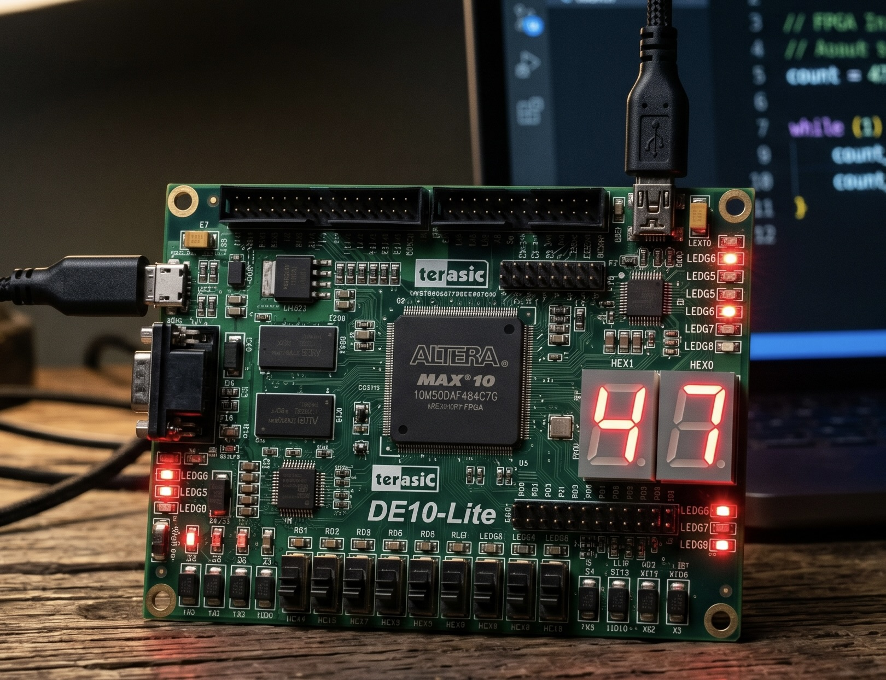

# MAX10 Nios II Embedded System

Welcome to this System on a Chip (SoC) embedded project. The core of this repository highlights the integration of custom **bare-metal C programming** with underlying hardware (RTL) developed for the Intel MAX 10 FPGA (DE10-Lite).


*Cover image enhanced by AI.*

## 🧠 Why is this project useful?

Standard software engineering relies on operating systems to manage memory, threads, and hardware interfaces. However, in low-level embedded systems, deterministic performance and latency are critical.

This project bridges the gap between hardware architecture and software engineering by creating a custom **System on a Chip (SoC)** from scratch. Instead of writing software for a commercial CPU, this repository demonstrates how to instantiate a custom **Nios II Soft Processor** directly into an FPGA's logic fabric, establish Memory-Mapped Avalon (Avalon-MM) interconnects, and write **bare-metal C code** that interacts directly with physical memory registers.

**Key Features:**

- Custom hardware logic defined in Platform Designer (`.qsys`) and Verilog.
- Direct hardware-software handshaking using C pointers and memory base addresses.
- Bare-metal C routines managing real-time inputs (switches, pushbuttons) and hardware outputs (LEDs, 7-segment displays).
- Complete avoidance of OS overhead, achieving ultra-low latency execution loops.

## 📂 Repository Structure

- **`software_app/`**: The heart of the C-Family logic. Here you will find the `main.c`, custom peripheral drivers in `src/`, and headers in `inc/`. This is purely bare-metal C code compiled specifically for the Nios II architecture using the provided `Makefile`.
- **`hardware_design/`**: Contains the physical system blueprint. Includes the Platform Designer architecture (`Embed.qsys`), the top-level Verilog wrappers (`.v`), and Quartus Prime project files (`.qpf`, `.qsf`).
- **`docs/`**: Comprehensive technical reports detailing the iterative integration of the system (from the initial FPGA setup to the final Nios II software layer).

## 🚀 How to Build and Run

To execute this project, you need Intel Quartus Prime (for synthesizing the hardware) and the Nios II Command Shell (for compiling the C code).

### 1. Synthesize the Hardware (RTL)

1. Open Intel Quartus Prime.
2. Open the project file located at `hardware_design/Embed.qpf`.
3. Run **Compile Design** to synthesize the Nios II processor and its peripherals into the FPGA logic.
4. Open the **Programmer** tool, connect your DE10-Lite via USB (JTAG), and program the generated `.sof` bitstream into the board. The hardware is now alive but awaiting execution instructions.

### 2. Compile and Load the C Software

1. Open the **Nios II Command Shell** (or your containerized environment, like OrbStack).
2. Navigate to the software directory:
   ```bash
   cd software_app
   ```
3. Run `make clean` to clear any old cached paths, then run `make` to compile the bare-metal C code into an `.elf` (Executable and Linked Format) binary.
   ```bash
   make clean
   make
   ```
4. Finally, download the executable into the soft processor's RAM and start execution via JTAG:
   ```bash
   nios2-download -g Embed_System.elf
   nios2-terminal
   ```
5. You can now observe the processor executing the C code, interact with the physical switches on the board, and view the terminal output dynamically via the JTAG UART connection.

---

_Built from scratch, demonstrating engineering mastery over both digital logic and low-level C programming._
