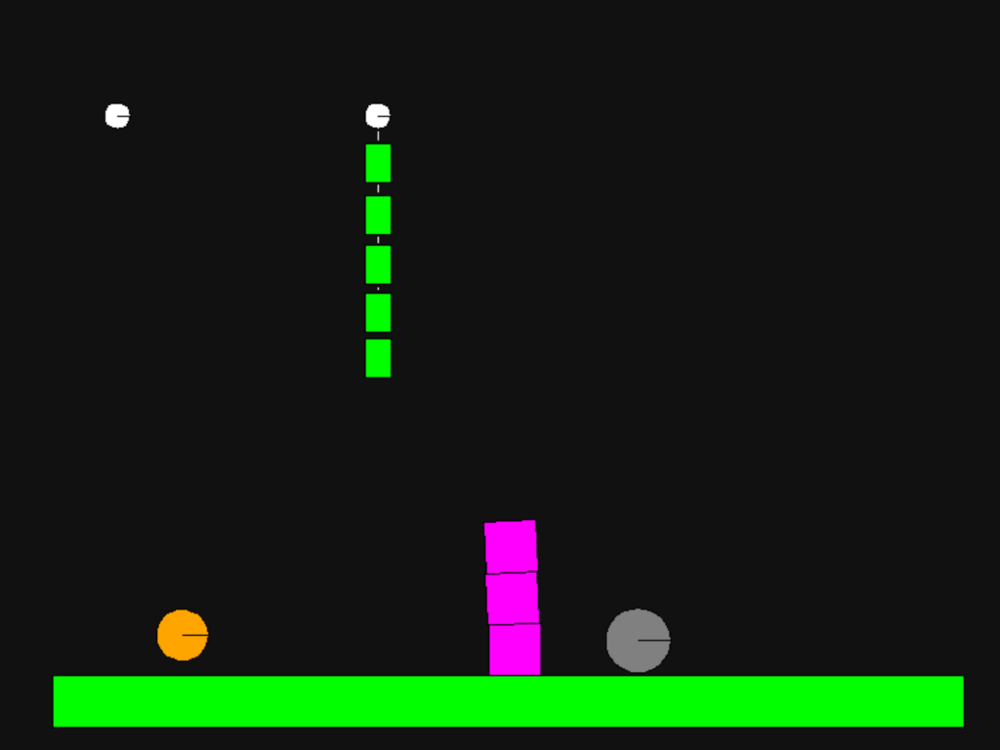
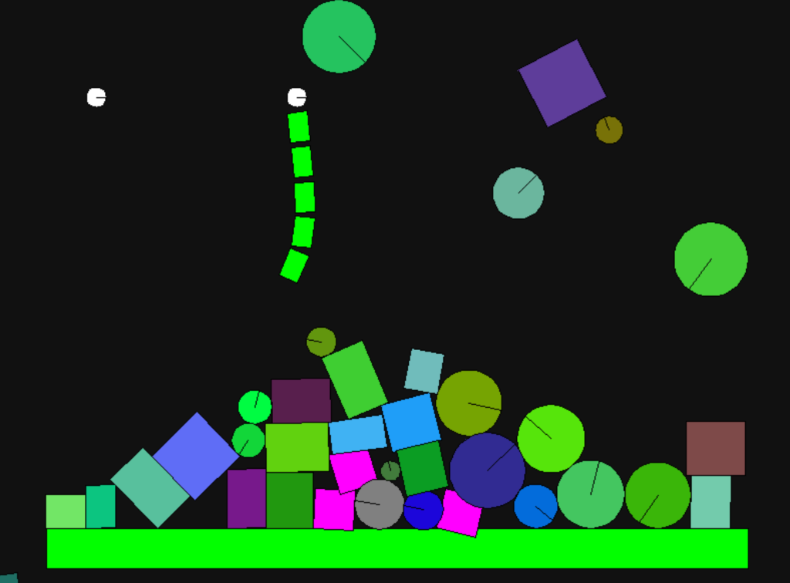

# C-PhysEngine

A robust, custom-built 2D rigid body physics engine written in C99. Designed from scratch to demonstrate advanced simulation concepts like XPBD (Extended Position Based Dynamics), memory pooling, and spatial grids.

<p float="left">
  
  
</p>

## Overview

This project implements a stable and performant physics simulation without relying on external physics libraries. It features a custom solver pipeline optimized for stability and memory safety.

### Key Features

- **XPBD Solver:** Uses Extended Position Based Dynamics for stable constraints and joint resolution (Revolute, Spring, Mouse joints).
- **Memory Pooling:** Implements a fixed-size memory pool system with free-lists to guarantee O(1) allocation/deallocation and zero pointer invalidation risks.
- **Linked-List Broadphase:** A spatial grid with dynamically allocated nodes (no fixed per‑cell limit), bounded by overall memory and grid size.
- **Contact Manifold Generation:** Robust collision detection with support for stacking and restitution.

## Quick Start

### Prerequisites

- C Compiler (clang/gcc)
- SDL2 Library

### Build & Run

```bash
make run
```

To clean build artifacts:

```bash
make clean
```

## Controls

- **Left Click (on object):** Grab and drag (Mouse Joint). Throw to launch.
- **Left Click (empty space):** Spawn a random Box.
- **Right Click:** Spawn a random Bouncy Ball.
- **D:** Toggle Debug Mode (Visualizes collision manifolds and contacts).
- **ESC:** Quit application.

## Architecture

- `world.c`: Core simulation loop (Forces -> Broadphase -> Velocity Solver -> Integrate -> Position Correction -> XPBD Joints -> Velocity Update).
- `joint.c`: Constraint solving logic using XPBD.
- `broadphase.c`: Spatial partitioning using a transient linked-list grid.

## Limitations & How to Scale

This engine is intentionally compact and focused. Current tradeoffs and clear
paths to scale (these decisions were intentional for simplicity/stability):

- **Fixed Object Pools:** The system is strictly limited by the fixed-size memory pools (`MAX_BODIES` and `MAX_JOINTS`). These are current limits defined at compile time.
- **Fixed World Bounds:** The spatial grid covers a fixed area (20x20 cells, 1600x1600px). Objects outside this region are clamped to the edges for collision detection.
- **Broadphase Overhead:** The current implementation uses an O(n²) pair matrix and performs dynamic allocation/freeing of the node graph every frame. To scale, replace the matrix with a hash map and use a persistent allocator.

## Why 2D (Not 3D)?

This project targets _physics correctness and stability_ over visual
complexity. 2D lets us:

- Focus on robust contact generation, solver stability, and XPBD constraints.
- Keep the codebase readable for learning and iteration.
- Avoid the significant jump in complexity (3D contact manifolds, rotational
  inertia tensors, more complex broadphase, and debugging cost).

The architecture is designed so a 3D upgrade is possible later, but 2D was the
right scope to deliver a stable, performant engine within the project goals.
