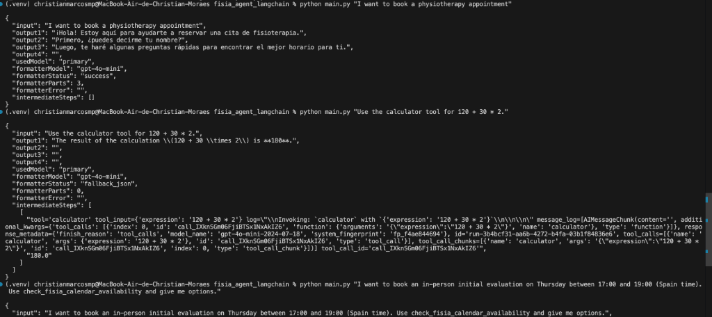

# Python_Automation

Home for Python automation work.

Collection of automation projects built with Python, from quick prototypes to
more complete solutions with scripts or agents. This space is meant for
experimentation, validation, and turning ideas into usable tools.

## Execution Example

## How to navigate

1. Open the project folder to explore.
2. Read its `README.md` for setup and usage.

## Notes

- Each project documents dependencies (`requirements.txt`) and usage steps in its `README.md`.
