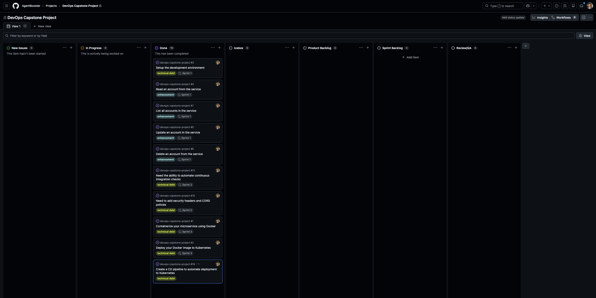

# DevOps Capstone Project — Python Microservice CI/CD

## Main Repository

The full source code, commits, pull requests, workflows, Dockerfile, Kubernetes manifests, and Tekton pipeline files are available here:

[View full project repository](https://github.com/AgentBooster/devops-capstone-project)

Repository URL:  
https://github.com/AgentBooster/devops-capstone-project

## Overview

  

This project is a DevOps capstone built around a Python Flask microservice for account management.  
It covers the full development lifecycle of a backend service: agile planning, REST API development, test-driven development, continuous integration, security hardening, containerization, Kubernetes deployment, and continuous delivery with Tekton.

The project was developed as part of a hands-on DevOps workflow using GitHub, Docker, OpenShift, Kubernetes, GitHub Actions, and Tekton pipelines.

## What This Project Includes

- Agile planning with user stories, labels, sprints, and Kanban workflow
- RESTful API development using Python and Flask
- Test-driven development with unit tests and coverage
- GitHub Actions CI workflow for automated linting and testing
- Security headers and CORS configuration using Flask-Talisman and Flask-CORS
- Docker containerization with a production-style Dockerfile
- Kubernetes/OpenShift deployment using reusable YAML manifests
- Tekton CD pipeline for automated clone, lint, test, build, and deploy stages

## Technologies Used

- Python 3.9
- Flask
- PostgreSQL
- Docker
- Kubernetes
- OpenShift
- Tekton
- GitHub Actions
- Git / GitHub
- Nose / Flake8

## Project Focus

The main goal of this project was not only to build a REST API, but to demonstrate a complete DevOps delivery workflow around it.

The project shows how a backend service can move from local development to automated testing, containerization, deployment, and continuous delivery using modern DevOps tools.
