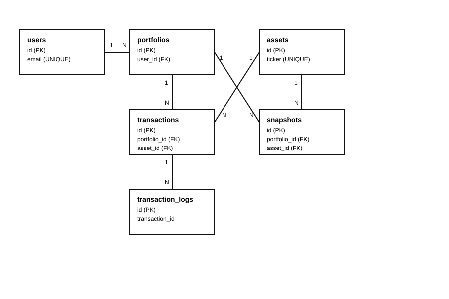

# Portfolio Engine - Design

## Video Overview: [https://youtu.be/5bQ4sG4z0AA](https://youtu.be/5bQ4sG4z0AA)

**How to Design a Financial Database: Joins, Triggers, and Indexes (SQL)**

## Purpose and Scope

Portfolio Engine is a relational database for tracking investment activity with a focus on correctness, clarity, and historical visibility. The core objective is to keep transactions as the source of truth while still making portfolio reporting practical through precomputed snapshots.

The schema supports the following use cases:

- A single user with multiple portfolios (for example: "Retirement", "Trading", and "Emergency FX").
- Repeated buys and sells of the same asset over time.
- Partial sales (for example: buy 100 units, then sell 30 units, leaving 70 net units).
- Manual corrections to transaction values through `UPDATE` statements.
- Historical tracking of observed prices and performance metrics at specific timestamps.

It intentionally does not try to model a full broker back office. That means it excludes fees, taxes, dividends, stock splits, and automatic FX conversions. This project chooses a constrained scope so the core relational model remains understandable and testable in SQLite.

## Design Strategy

The schema is mostly normalized (3NF-oriented). Master data lives in dedicated tables (`users`, `assets`), while event data lives in `transactions`. This reduces duplication. For example, ticker metadata is stored once in `assets` and referenced by ID in every transaction.

At the same time, the design includes one intentional denormalization: `snapshots`. A snapshot stores derived fields (`current_value`, `performance_pct`, etc.) so historical reports do not require expensive recalculation against changing market prices. This tradeoff is discussed later.

## Entities and Field Rationale

### `users`

- `id`: simple integer primary key for internal joins.
- `full_name`: required display field.
- `email`: unique natural identifier, used for lookup in example queries.
- `created_at`: default timestamp to preserve account creation history.

`created_at` matters because user onboarding date is operationally useful and cannot be reconstructed if not stored. It also helps with audit/debug tasks ("when was this account created?").

### `portfolios`

- `user_id` links each portfolio to exactly one user.
- `name` and optional `description` allow multiple purpose-specific portfolios.
- `UNIQUE (user_id, name)` prevents duplicate portfolio names per user.
- `created_at` preserves timeline and allows later reporting by portfolio age.

The uniqueness constraint is a practical business rule: two different users can both have "Retirement", but one user cannot accidentally create that same named portfolio twice.

### `assets`

- `ticker` is globally unique to avoid duplicate market identifiers.
- `name` stores human-readable label.
- `asset_type` has a `CHECK` constraint (`STOCK`, `FX`) to enforce a controlled asset domain.

`asset_type` is included to avoid ambiguous interpretation of symbols and to enable type-specific behavior later (for example, different valuation logic for equities and currency pairs).

### `transactions`

- `transaction_type` restricted to `BUY` or `SELL`.
- `units` and `buy_price` must be greater than zero.
- `executed_at` stores execution date/time as text.
- `portfolio_id` and `asset_id` connect each transaction to its owner context.

This table is the canonical ledger. Portfolio holdings are derived from transactions, not entered directly, which reduces inconsistency risk.

Why `REAL` and not `NUMERIC`? In SQLite, `NUMERIC` is type affinity, not strict fixed-decimal precision. `REAL` keeps calculations simple for this project. The tradeoff is floating-point rounding behavior.

### `snapshots`

`snapshots` stores observed portfolio-asset performance at a point in time:

- Position data (`units`, `buy_price`).
- Market data (`current_price`).
- Derived metrics (`initial_value`, `current_value`, `performance_pct`).
- `observed_at` for time anchoring.

This table is not the source of truth for holdings; it is a historical reporting layer.

### `transaction_logs`

This table captures deleted transactions with a `deleted_at` timestamp. It duplicates key transaction fields so deleted records remain auditable even after removal from the live ledger.

## Relationships and Integrity

The schema uses 1:N relationships throughout:

- One user to many portfolios.
- One portfolio to many transactions.
- One asset to many transactions.
- One portfolio to many snapshots.
- One asset to many snapshots.

Integrity is enforced with foreign keys from child tables to parent tables. In SQLite, these constraints prevent orphan references when foreign key enforcement is enabled. The current schema does not specify `ON DELETE CASCADE`; default behavior is restrictive (`NO ACTION`/`RESTRICT` semantics). This was a conservative choice: it avoids accidental large deletes and forces explicit data management decisions.

In practical terms (with `PRAGMA foreign_keys = ON`):

- You cannot validly reference a portfolio or asset that does not exist.
- Deleting a parent row that still has dependent children is blocked unless data is cleaned first.
- Audit data in `transaction_logs` remains independent of future parent table changes because it stores copied scalar values.

## View and Query Behavior

The `portfolio_summary` view computes net units as:

- Add `units` for `BUY`.
- Subtract `units` for `SELL`.
- Group by `portfolio_id` and `asset_id`.

This design centralizes holding logic in SQL, so consumer queries do not need to reimplement buy/sell arithmetic repeatedly. It also naturally supports partial sales and multiple lots. A portfolio can show negative net units if more units are sold than bought; the current schema does not block that case.

## Indexing and Performance Tradeoffs

The project defines two explicit indexes:

- `assets_ticker` on `assets(ticker)`.
- `portfolios_user_id` on `portfolios(user_id)`.

Why these two?

- `assets(ticker)` accelerates ticker-based lookups used in insert/update workflows.
- `portfolios(user_id)` accelerates "all portfolios for one user" patterns and join filters by user.

Cost/benefit:

- Benefit: faster read performance for frequent lookup paths in `queries.sql`.
- Cost: additional storage and slower writes on indexed tables due to index maintenance.

For the query patterns shown in `queries.sql`, this is a practical tradeoff. If data volume grows, additional indexes may be warranted on `transactions(portfolio_id, asset_id)` and `snapshots(portfolio_id, observed_at)` to speed holdings and latest-snapshot queries.

## Snapshot Denormalization Tradeoff

Snapshots denormalize derived metrics on purpose. The alternative would be to compute all performance on demand from raw transactions plus live prices. That alternative is more normalized but has two drawbacks:

- Historical values become unstable if price sources change.
- Query cost increases for time-series reporting.

By storing snapshots, this project accepts controlled redundancy to gain:

- Fast reads for "what did I see at time T?"
- Reproducible historical reports.
- Clear separation between transactional ledger and reporting state.

Main tradeoff: consistency management. If a past transaction is edited, existing snapshots may no longer match recomputed results unless they are regenerated. This is acceptable in this scope and is documented as a limitation.

## Audit Log Design

The trigger `log_transaction_delete` runs `AFTER DELETE` on `transactions` and inserts a copy into `transaction_logs`. This captures:

- Original transaction identity and foreign keys.
- Type, units, price, and execution time.
- Deletion timestamp.

Why trigger-based auditing instead of application-only logging?

- It guarantees logging regardless of which client issues the `DELETE`.
- It keeps audit policy close to the data.
- It reduces risk of a caller forgetting to log manually.

What if a transaction is edited (`UPDATE`) instead of deleted?

- Current schema does not log updates.
- Final state remains in `transactions`, but change history is lost.
- A possible extension is to add `AFTER UPDATE` triggers and store before/after values (or versioned rows).

## Explicit Limitations and Extension Path

Current intentional limitations:

- No transaction fees or commissions.
- No dividend/coupon income events.
- No tax lots or realized/unrealized tax reporting.
- No automated FX conversion table.
- No strict prevention of overselling in SQL constraints.
- No update audit trail, only delete audit.
- No automatic snapshot refresh after transaction corrections.

What would be required to extend:

- Add `fees`, `currency`, and possibly `fx_rate` columns to transactions.
- Introduce an `income_events` table for dividends/interest.
- Add reference tables for currencies and historical FX rates.
- Add lot-level tracking if FIFO/LIFO accounting is required.
- Add constraints/triggers to block invalid sells when business rules disallow shorting.
- Add update auditing and snapshot invalidation/rebuild workflows.

Within its chosen boundary, this schema is coherent: transactions remain authoritative, summaries are reproducible, and deletes are auditable. The result is a practical financial-tracking foundation that is simple enough for learning but structured enough to evolve.

## ER Diagram

