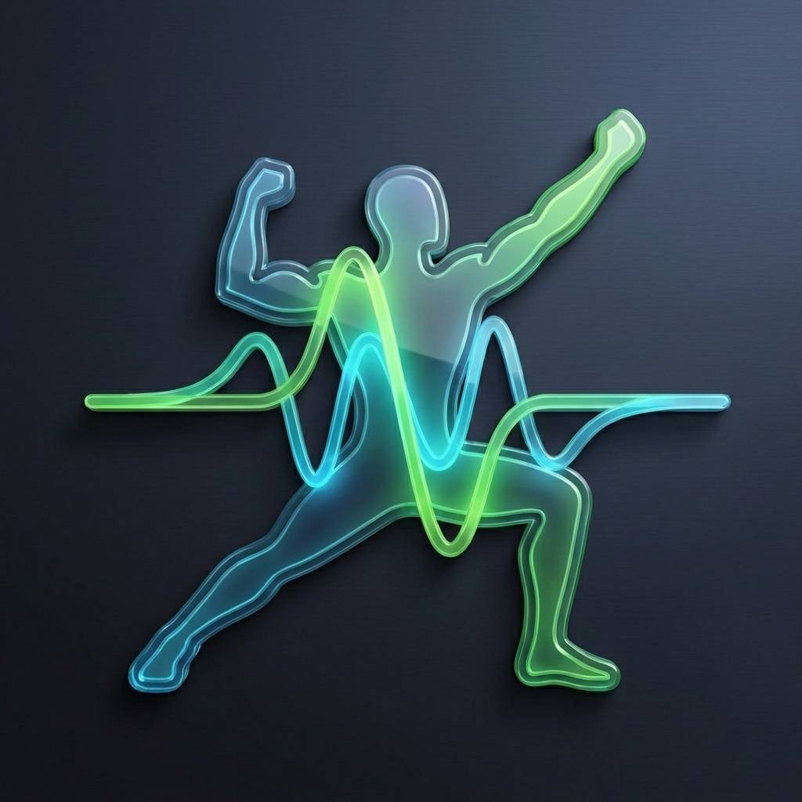
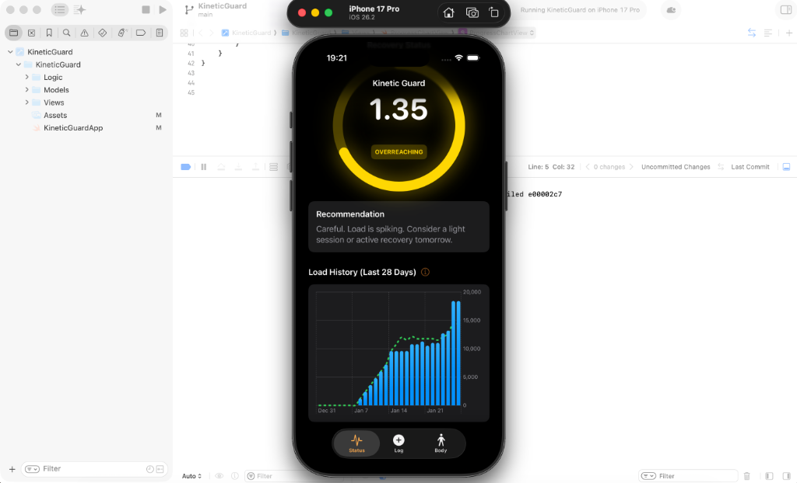
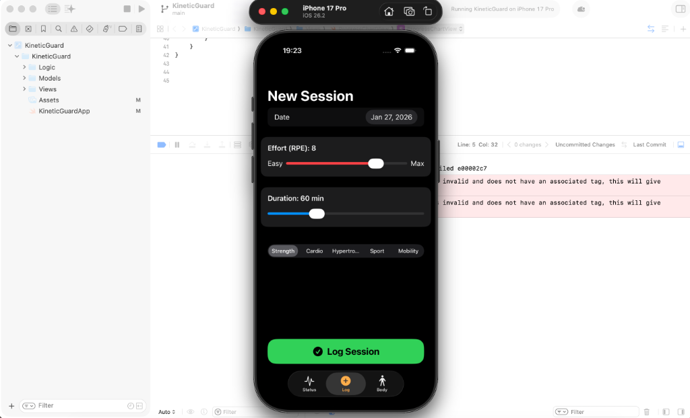
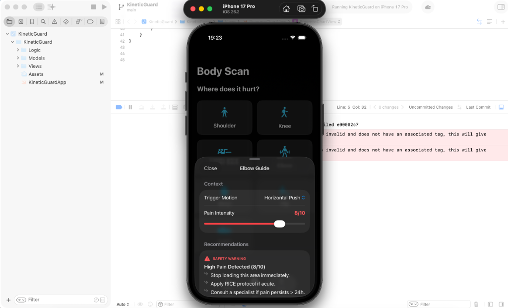

# Kinetic Guard

#### Video Demo: [https://youtu.be/O4-KLdqeJXs](https://youtu.be/O4-KLdqeJXs)

**Kinetic Guard: Load Management for Athletes on iOS with Swift and SwiftData**

#### Description:

**Kinetic Guard** is an intelligent load management application for iOS designed to solve a specific problem in sports performance: the ambiguity between healthy fatigue and injury risk. It acts as a digital safety belt for athletes, providing objective "Go/No-Go" signals based on subjectively reported data.

  

## How to Run & Test (Local Setup)

This project is a native iOS application built with **SwiftUI** and **SwiftData**. To run it, you need a Mac with Xcode installed.

### 1. Open the Project

1.  Navigate to the `KineticGuard/Xcode/` folder.
2.  Double-click `KineticGuard.xcodeproj` to open it in **Xcode**.

### 2. Launch the Simulator

1.  In the top toolbar of Xcode, ensure the target is set to **Kinetic Guard**.
2.  Select the **iPhone 17** simulator (or any recent iPhone model).
3.  Press `Cmd + R` or click the **Play** button (▶️) to build and run the app.
    > **Note:** Initial compilation may cause temporary heating on Apple Silicon Macs (e.g., MacBook Air M3). This is normal; temperature and CPU usage will normalize once the Simulator launches.

### 3. Usage Guide (What to Test)

Once the app launches in the Simulator:

- **Dashboard:** You will see an initial "Calibrating" status until enough data is collected.
- **Log a Workout:** Tap the **Log** tab. Enter a session (e.g., Duration: 60, RPE: 7) and tap **Log Session**. Watch the dashboard update.

    

- **Check for Pain:** Go to the **Body Scan** tab. Tap a body part (e.g., Knee) -> Select a Trigger -> Adjust Pain Slider. Verify that the app gives you specific advice (Triage Logic).
  

Unlike general-purpose fitness trackers that overwhelm users with data, this project focuses on a single, critical metric: the **Acute:Chronic Workload Ratio (ACWR)**.

## The Problem: The "Silent" Injury

Athletes often fall into the trap of "too much, too soon." Injury risk skyrockets not necessarily when load is high, but when the _change_ in load spikes faster than the body's adaptation rate. This is the "Terrible Toos" of training. The average gym-goer has no tool to visualize this accumulation of fatigue until it manifests as pain.

## The Solution: ACWR & Deterministic Logic

Kinetic Guard implements the **Gabbett Model** of workload management. To avoid dependence on probabilistic AI decisions (although future implementation is possible), the app uses transparent, deterministic mathematical formulas to calculate a safety score.

### Core Logic (`RecoveryLogic.swift`)

The application calculates two variables:

1.  **Acute Load (Fatigue)**: The sum of the user's workload over the last 7 days.
2.  **Chronic Load (Fitness)**: The rolling average of the user's workload over the last 28 days (adaptively scaled for users with < 4 weeks history).

The ratio `Acute / Chronic` determines the **Recovery Score**:

- **< 0.8 (Blue)**: Detraining risk. The user is doing too little to maintain fitness.
- **0.8 - 1.3 (Green)**: The "Sweet Spot." Optimal progression with minimal injury risk.
- **1.3 - 1.5 (Yellow)**: Overreaching. A warning zone where performance gains come with increased risk.
- **> 1.5 (Red)**: The "Danger Zone." Statistically, injury risk increases significantly here.

The app uses **sRPE (Session Rating of Perceived Exertion)** as the unit of load.
Formula: `Load = Duration (minutes) * Intensity (1-10)`.
This allows the app to be modality-agnostic, comparing the physiological stress of a heavy lifting session (High RPE, Low Duration) with a long run (Medium RPE, High Duration) on the same scale.

## File Structure & implementation

The project follows a modular **MVVM-like** architecture (Model-View-ViewModel), leveraging Swift's modern concurrency and data handling features.

### `KineticGuardApp.swift`

The entry point of the application. It initializes the **SwiftData** container, ensuring that the SQLite database schema (`UserProfile`, `WorkoutSession`, `JointRecord`) is ready before the UI loads. This centralizes the dependency injection for the entire app.

### `Models/KineticGuardModels.swift`

This file defines the data schema using the `@Model` macro (SwiftData).

- **`WorkoutSession`**: The primary entity. It stores not just raw numbers but computed properties like `sRPE` to encapsulate business logic within the model itself.
- **`BodyPart`**: An enum to ensure type safety and restrict input to valid anatomical zones.
- **`JointRecord`**: Defined in the schema for pain tracking. _Note: Not currently persisted by the UI in v1.0 (Triage only)._

### `Logic/RecoveryLogic.swift`

The "Brain" of the application. This stateless service class contains static functions that process raw data into actionable insights.

- **`calculateACWR`**: Handles the sliding window math.
  - **Adaptive Algorithm**: For new users (< 28 days history), it uses a dynamic divisor to calculate Chronic Load based on available weeks (e.g., dividing by 1.5 instead of 4.0), ensuring the score is meaningful during the calibration phase.
- **`suggestPivots`**: A sophisticated Triage Matrix that maps pain inputs to actionable advice.
  - **Inputs**: Location (Body Part) + Trigger (Movement Pattern) + Intensity (1-10).
  - **Outputs**:
    - _Low Intensity (1-3)_: Technique adjustments (e.g., "Reduce ROM").
    - _Medium Intensity (4-6)_: Exercise substitutions (e.g., "Back Squat" -> "Box Squat").
    - _High Intensity (7+)_: Safety Red Flags (Medical referral).
  - **Note**: Pain history is not currently persisted; the Body Map provides real-time recommendations only. Version 1.0 does not include pain calibration.

### `Views/`

The UI is built with **SwiftUI** to ensure a native, responsive experience.

- **`ContentView.swift`**: The main navigation hub using a `TabView` structure.
- **`DashboardView.swift`**: The "Traffic Light" interface. It dynamically renders a circular progress ring that changes color based on the real-time ACWR score.
- **`QuickEntryView.swift`**: Designed for speed. It uses slider controls and haptic feedback to make logging a session feel tangible and quick.
- **`BodyMapView.swift`**: A visual selector for pain tracking. When a user logs pain, it immediately interacts with `RecoveryLogic` to present the "Pivot" sheet, closing the loop between data entry and actionable advice.

## Design Choices

### Why SwiftData over CoreData?

For this project in 2026, utilizing the latest Apple frameworks is essential. SwiftData reduces standard boilerplate code by ~70% compared to CoreData, allowing the codebase to remain clean and focused on business logic rather than database management.

### Why No External Dependencies?

The project uses zero third-party libraries. Every component, from the circular progress bar to the statistical math, is hand-coded. This ensures the app is lightweight (< 50MB), future-proof, and easy to audit—key requirements for high-reliability software.

### The "Pivot" System

Instead of just telling the user to "stop training" (which leads to non-compliance), the app suggests _alternatives_. This design choice acknowledges the psychological reality of athletes: they want to train. By offering a "Plan B," the app maintains user engagement while reducing risk.

Kinetic Guard is not just a logger; it is a decision support system for human performance.
