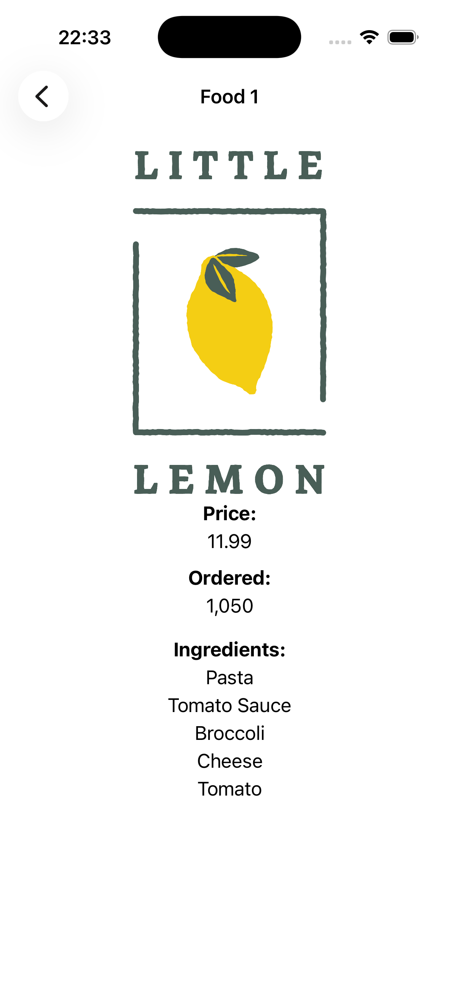
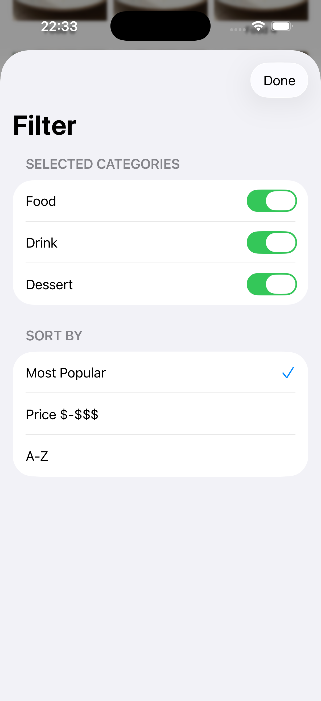

# Little Lemon Dinner Menu

An interactive iOS application for browsing the Little Lemon restaurant menu. Built with SwiftUI using the MVVM architecture.

  
  
  

## Requirements

- **Xcode**: Version 13.0 or later.
- **iOS**: Target iOS 15.0 or later.
- **macOS**: macOS Monterey or later recommended for development.

## Getting Started

1.  Clone the repository.
2.  Open `LittleLemonDinnerMenu.xcodeproj` in Xcode.
3.  Select a simulator (e.g., iPhone 15).
4.  Build and Run (`Cmd + R`).

## Key Features

- **Menu Grid**: Browse food, drinks, and desserts in a 3-column grid layout.
- **Detailed View**: View ingredients, price, and order count for each dish.
- **Filtering**: Options to filter by category and sort items (UI implementation).
- **Navigation**: Seamless navigation between menu and details.

## Technical Highlights

- **Framework**: SwiftUI
- **Architecture**: MVVM (Model-View-ViewModel)
- **Data Flow**: `ObservableObject` for state management.
- **Testing**: Unit tests included for data models.
