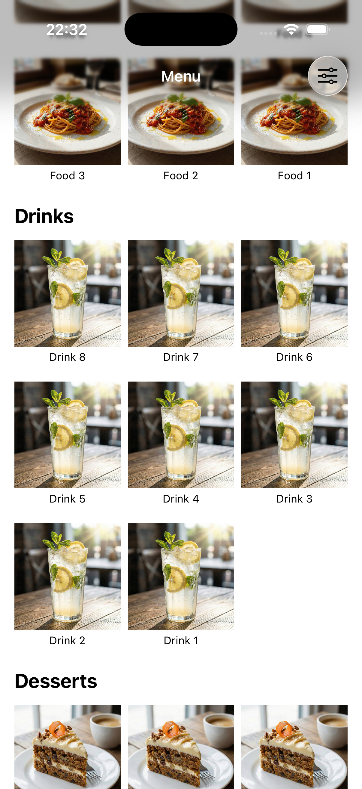
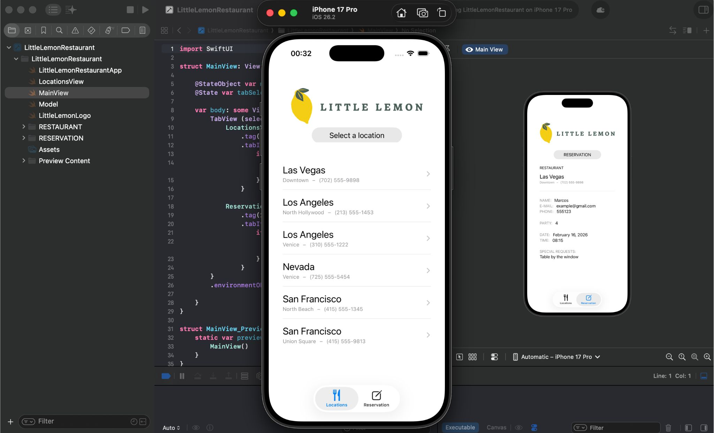

# Little Lemon Suite

Welcome to the **Little Lemon Suite**, a curated collection of two modern, native iOS applications built with **SwiftUI** and the **MVVM** architecture, centered around the "Little Lemon" restaurant experience.

  
  &nbsp;&nbsp;&nbsp;
  

## Included Projects

### 📱 [Little Lemon Dinner Menu](./LittleLemonDinnerMenu)
An interactive application for browsing the restaurant's menu offerings.
- **Focus**: Grid layouts, detailed item views, and dynamic category filtering.
- **Tech Highlights**: Unit tested data models, `ObservableObject` state management, seamless navigation.

### 🏢 [Little Lemon Restaurant](./LittleLemonRestaurant)
A comprehensive app designed to streamline location browsing and the reservation experience.
- **Focus**: Location selection and a robust reservation form with input validation.
- **Tech Highlights**: `@EnvironmentObject` usage, polished UI/UX, and clean separation of concerns.

---
*Developed with Xcode 13+ targeting iOS 15.0+ using Swift 5.*
