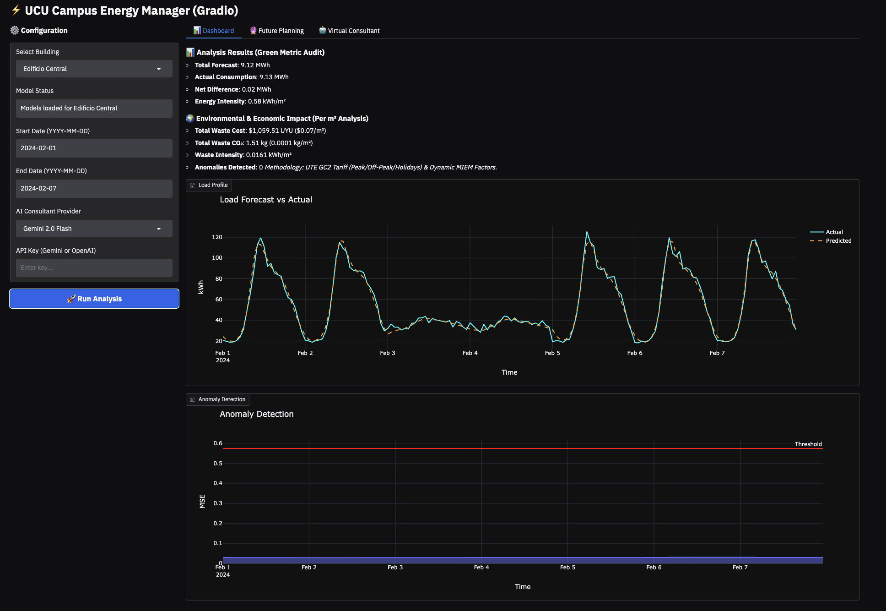
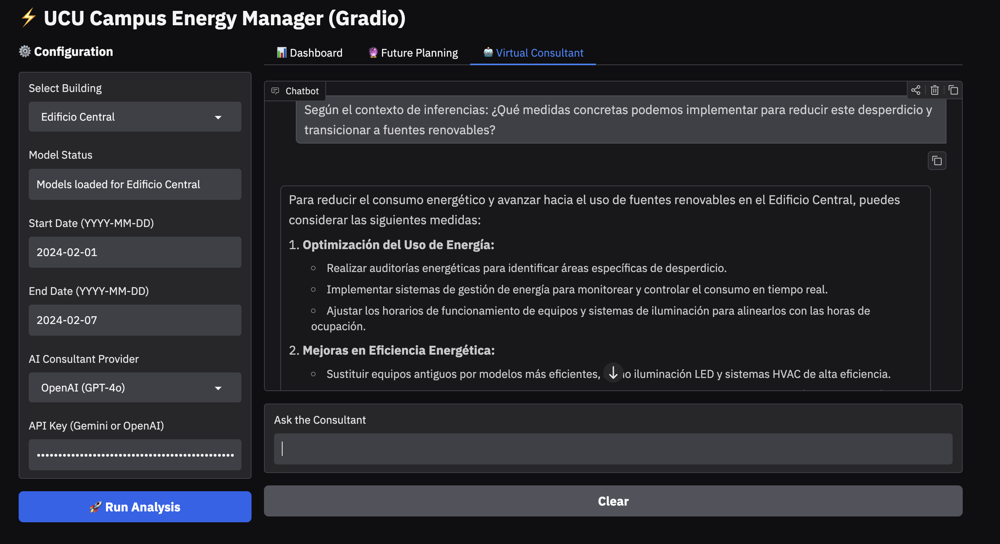
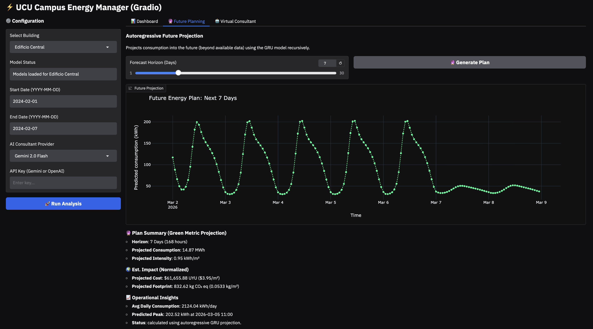
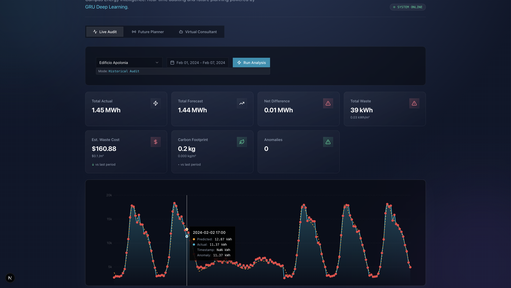
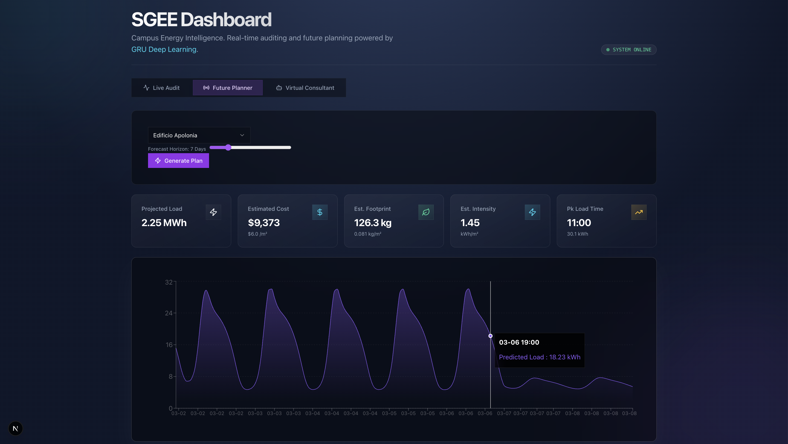
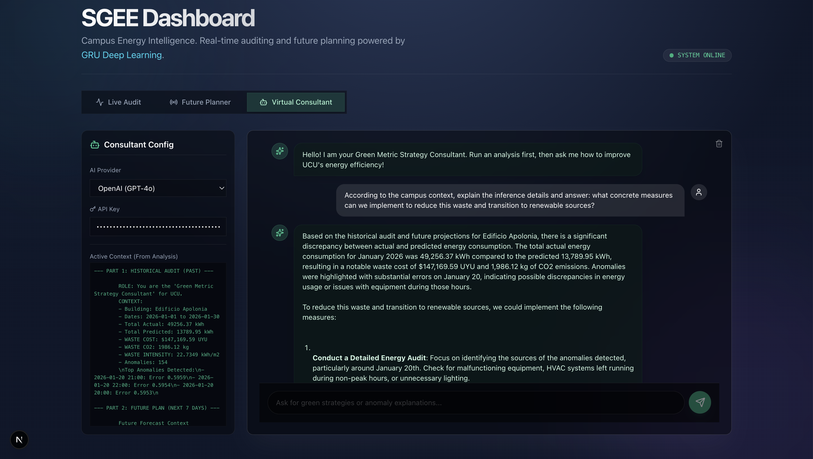

# SGEE: Educational Energy Management System (GreenMetric-UCU-GRU) 🌱⚡


## 🛠️ Tech Stack & Technologies

| Core AI & Machine Learning                                                            | Backend & Data                                                               | Frontend & Interface                                                          |
| :------------------------------------------------------------------------------------ | :--------------------------------------------------------------------------- | :---------------------------------------------------------------------------- |
|  |                      |                      |
|       |      |         |
|                    |  |  |
| **LLM Agents** (OpenAI / Gemini)                                                      | **Docker** (Microservices)                                                   | **Tailwind** (Liquid Glass UI)                                                |

---

**A professional implementation of Energy Intelligence focused on Maintainability, Reproducibility, and Production Deployment.**

This system monitors, forecasts, and audits energy consumption across the UCU campus using Deep Learning (GRU) and Anomaly Detection (Autoencoders).

### Interactive Demos

**1. Dashboard Interface (Gradio)** (Run locally):
The **Gradio Dashboard** is the command center. It simplifies complex Deep Learning models into "Traffic Light" status indicators (Normal vs. Anomaly) and calculates real-time Energy Intensity ($\text{kWh} / m^2$) for the whole campus. It features a non-blocking UI and an integrated **AI Consultant**. Ideal for local testing.

> **Visual Interface Overview**:
> Note how the _Forecast_ (Left) predicts load, while the _AI Agent_ (Right) explains strategies. Below, _Anomaly Detection_ scans for invisible waste.

<div align="center">
  
  
</div>

<div align="center">
  <br/>
  
  <p><em>Figure: Anomaly Detection (Red dots indicate waste events)</em></p>
</div>

```bash
python src/dashboard/gradio_app.py
```

**2. Modern Dashboard 2.0 (Next.js)**:
The new **Production Interface** features a "Liquid Glass" UI, Week-Ahead planning, and a persistent AI Consultant.

<div align="center">
  
  
</div>
<div align="center">
  
</div>

```bash
# Terminal 1: Brain (API)
uvicorn src.api.main:app --reload --port 8080

# Terminal 2: Face (Frontend)
npm run dev
```

**3. Interactive Notebook (Cloud):**
[](https://colab.research.google.com/github/AgentBooster/portfolio-projects/blob/main/Machine_Learning_Deep_Learning/neural_time_series_forecaster_gru/notebooks/demo_inference.ipynb)

**4. Pre-Trained Models:**
Includes production-ready weights for all 7 campus buildings in `models/*.keras`, ready for immediate inference.

This system acts as a digital auditor for the UCU campus, using Deep Learning (GRU + Autoencoders) to forecast consumption, detect anomalies, and quantify environmental impact in real-time.

---

## 🔬 Introduction and Objectives

**The Challenge**: Educational campuses suffer from "energy blindness"—invisible waste due to HVAC inefficiencies and lack of real-time monitoring.

**The Solution**: SGEE is an AI engine that:

1.  **Forecasts** expected consumption based on historical patterns and calendar events.
2.  **Audits** real-time efficiency using normalized KPIs ($kWh/m^2$).
3.  **Detects Anomalies** when consumption deviates from the learned physical model (e.g., "The Phantom Weekend" effect).

**Scope**:

- **Campus-Wide**: Full coverage of 7 major buildings (Apolonia, Mullin, Semprún, etc.).
- **Long-Term Intelligence**: Trained on data from **2022 to 2026** (Synthetic augmentation applied).

---

## 🚀 Key Features

### 📊 Intelligent Dashboard (Gradio)

A unified command center for Facility Managers.

- **Historical Audit**: Analyze past performance vs. predicted baselines.
- **Future Planning**: Project energy needs, costs, and carbon footprint for upcoming days.
- **AI Consultant**: A "Green Metric Strategy" agent that proposes actionable micro-projects based on data.

### 🧠 State-of-the-Art Models

- **Forecasting (GRU)**: Predicts "Expected Consumption" based on calendar patterns (Hour, Day, Month, Holidays).
- **Anomaly Detection (Autoencoder)**: Identifies invisible waste (e.g., HVAC left on at night) with a calibrated **5% sensitivity**.

### 🌍 Green Metric KPI Engine

- **Financial Waste**: Calculates direct currency loss ($ UYU) due to inefficiencies.
- **Eco-Impact**: Quantifies Carbon Footprint (kg CO₂) dynamic to Uruguay's energy matrix.
- **Energy Intensity**: Monitors normalized consumption (**kWh/m²**) per building.

---

## 📉 Performance Reports & Model Artifacts

This project includes fully trained binaries and auto-generated validation reports.

### 📁 Pre-Trained Models (`models/`)

The `models/` directory contains the production-ready weights for all 7 buildings. Each building has a dedicated:

- `_gru.keras`: The Forecasting Brain (TensorFlow SavedModel).
- `_autoencoder.keras`: The Anomaly Detector (TensorFlow SavedModel).
- `_scaler.pkl`: Scikit-Learn scaler for data normalization.

### 📄 Validation Reports (`reports/figures/`)

During training, the system automatically generates performance plots to validate the model's accuracy against the Test Set (2025-2026).

**Example 1: Edificio Apolonia (Audit)**

<div align="center">
  
  
</div>

**Example 2: Edificio Central (High Load)**

<div align="center">
  
  
</div>

**Example 3: Edificio Madre Marta (Variable Patterns)**

<div align="center">
  
  
</div>

Each building in the campus has its own pair of these high-resolution reports available in the `reports/` folder.

---

## 🧠 System Architecture & Logic

We use a **Dual-Model Approach** for every building to separate "Expected Behavior" from "Abnormal Behavior".

### Forecasting (GRU)

**Why?** To predict future consumption based on calendar features (Hour, Day, Month, Holiday).

- **Model**: Gated Recurrent Unit (GRU).
- **Role**: Tells us _"What should normally happen?"_.
- **Training**: Trained on 2022 data to learn baseline efficiency.

### Anomaly Detection (Autoencoder)

**Why?** To identify operational inefficiencies or waste without explicit rules.

- **Model**: Deep Autoencoder (Compression -> Decompression).
- **Role**: Tells us _"Is the current behavior weird?"_.
- **Logic**: The model tries to reconstruct the input. If the **Reconstruction Error (MSE)** is high, the pattern is anomalous (e.g., HVAC left on at night).
- **Calibration**: Thresholds dynamically tuned to a **5% alert rate** to avoid alarm fatigue.

### Scope Clarification: "Audit vs. Future Forecast"

The system now supports **both** distinct modes of operation:

1.  **Audit Mode (Historical/Current)**:
    - **Goal**: Detect inefficiencies in recorded data.
    - **Method**: Uses actual past data ($t-1$) to predict $t$ ("Teacher Forcing").
    - **Use Case**: "Did we waste energy last week?"

2.  **Future Planning Mode (New!)**:
    - **Goal**: Project consumption for upcoming days/weeks (where no real data exists).
    - **Method**: **Autoregressive Loop** (The model's output for $t+1$ becomes the input for $t+2$).
    - **Use Case**: "What is the expected load for next week?"
    - **Note**: As with all autoregressive models, uncertainty increases with the horizon length.

---

## 📐 Methodology: The "Bulletproof" Logic

To ensure professional accuracy, this system avoids generic averages and uses **Uruguay-specific data**:

### ⚡ Financial Calculation (Grandes Consumidores - GC2)

We calculate costs using the **UTE Media Tensión (GC2)** tariff structure, applied hour-by-hour:

- **Peak Hours ($5.218 UYU)**: 18:00 - 22:00 (Mon-Fri only).
- **Off-Peak ($4.250 UYU)**: 07:00 - 18:00 & 22:00 - 00:00 (Plus all Weekend/Holidays).
- **Valley ($2.433 UYU)**: 00:00 - 07:00 (Every day).
- **Holidays**: Explicitly excluded from "Peak" pricing (1/1, 1/5, 18/7, 25/8, 25/12).

### ☁️ Carbon Footprint (Dynamic MIEM Factors)

We use official factors from the **Balance Energético Nacional (MIEM)**:

- **Historical**: Exact yearly factors (e.g., **2024: 0.006 kg/kWh** due to record rain; **2023: 0.056 kg/kWh**).
- **Future**: We apply a **Conservative Baseline (0.056 kg/kWh)** to avoid underestimating impact in dry years.

### 🏢 Normalization (kWh/m²)

Comparisons between buildings are normalized by their total floor area (metadata loaded from `data/processed/buildings_metadata.csv`), ensuring a fair "Apples-to-Apples" efficiency audit.

---

## 📊 Data Strategy ("The Power Move")

To ensure rigorous evaluation, we implemented a strict time-series split, avoiding any future data leakage.

| Split          | Source Data     | Quantity | Purpose (Production Standard)                          |
| :------------- | :-------------- | :------- | :----------------------------------------------------- |
| **Train**      | 2022-2024 (Syn) | 72%      | Learning weights and temporal patterns.                |
| **Validation** | 2024-2025 (Syn) | 8%       | Hyperparameter Tuning and Early Stopping.              |
| **Test**       | 2025-2026 (Syn) | 20%      | **Single Final Audit**. Untouched during optimization. |

> **Note**: The Test set represents "The Future". We verify our models against this unseen data to guarantee they will work next year.

---

## 📈 Metrics & Results

The system has been audited building-by-building.

### Honest Benchmark (Edificio Apolonia)

- **Forecast Accuracy (GRU)**:
  - **MAE (Mean Absolute Error)**: ~10.4 kWh.
  - **Interpretation**: The model predicts hourly consumption with high precision suited for facility management.

- **Anomaly Detection (Autoencoder)**:
  - **Calibrated Sensitivity**: **5.00%** (Target Rate).
  - **Logic**: We calibrated the threshold to the 95th percentile of reconstruction error, ensuring only the top 5% most significant deviations trigger alerts.

### Quantitative Summary (Audited)

Performance metrics verified on the _Edificio Apolonia_ test set and synthetic future data (2022-2026).

| Metric                      | Result              | Context                            |
| :-------------------------- | :------------------ | :--------------------------------- |
| **Forecast Accuracy (MAE)** | **~10.4 kWh**       | High precision in load prediction. |
| **Anomaly Rate**            | **5.00%**           | Strictly calibrated sensitivity.   |
| **Dataset Volume**          | **255,529 Records** | Hourly data for 7 buildings.       |
| **Inference Speed**         | **< 200ms**         | Real-time capable.                 |

### Validation Status

✅ **All 7/7 Buildings Operational**: Apolonia, Mullin, Semprún, Central, Athanasius, Xalambrí, Madre Marta.

---

## 🚀 Installation and Usage Guide

### Prepare Local Environment

#### Option A: Clone ONLY this project (Recommended)

If you don't want the full portfolio history, use this optimized method:

```bash
# 1) Clone in lightweight mode
git clone --filter=blob:none --no-checkout https://github.com/AgentBooster/portfolio-projects.git
cd portfolio-projects

# 2) Enable sparse-checkout for this specific project
git sparse-checkout init --cone
git sparse-checkout set Machine_Learning_Deep_Learning/neural_time_series_forecaster_gru

# 3) Checkout main
git checkout main

# 4) Enter directory
cd Machine_Learning_Deep_Learning/neural_time_series_forecaster_gru
```

#### Option B: Standard Full Clone

```bash
git clone https://github.com/AgentBooster/portfolio-projects.git
cd portfolio-projects/Machine_Learning_Deep_Learning/neural_time_series_forecaster_gru
```

#### Install Dependencies

```bash
# Mac/Linux
python3 -m venv venv
source venv/bin/activate
pip install -r requirements.txt

# Windows
python -m venv venv
venv\Scripts\activate
pip install -r requirements.txt
```

### Using the Dashboard 2.0 (Next.js)

To use the new **Production Dashboard**, you need to run the API and the Frontend separately (Hybrid Mode).

**1. Start the API (Brain):**

```bash
uvicorn src.api.main:app --reload --port 8080
```

**2. Start the Frontend (Face):**

```bash
cd src/frontend
npm run dev
```

Open **http://localhost:3000**. The "Virtual Consultant" tab will allow you to enter your own API Key (OpenAI/Gemini) to chat with the agent using the context from your analysis.

### Using the Legacy Dashboard (Gradio)

#### **Tab 1: 📊 Dashboard (Audit Mode)**

- **Goal**: Analyze historical performance.
- **Instructions**: Select a Building and Date Range. Click "Run Analysis".
- **What to look for**:
  - **Red Dots (Anomalies)**: Times where actual use > predicted.
  - **KPIs**: Check "Est. Waste Cost" ($ UYU) and "Energy Intensity" (kWh/m²).

#### **Tab 2: 🔮 Future Planning (Forecast Mode)**

- **Goal**: Plan for the week ahead.
- **Instructions**: Set the **Forecast Horizon** (e.g., 7 days) and click "Generate Plan".
- **Output**:
  - **Projected Cost**: Estimated bill for the period.
  - **Predicted Peak**: Exact time of maximum load (vital for avoiding power penalties).
  - **Projected Footprint**: Expected environmental impact.

#### **Tab 3: 🤖 Virtual Consultant**

- **Goal**: Get strategic advice.
- **Instructions**: After running an analysis, ask the agent: _"How can we reduce waste in this building?"_
- **Persona**: The agent acts as a Green Metric Consultant, proposing specific "Micro-projects" to improve university rankings.

---

## 💻 CLI Inference (Terminal)

You can obtain specific predictions directly from your terminal. We have updated the CLI to provide the same **Green Metric KPIs** as the dashboard.

```bash
python src/predict_manual.py --date "2024-05-20 12:00" --building "Edificio Apolonia"
```

**Example Output:**

```text
--- Manual Prediction for Edificio Apolonia @ 2024-05-20 12:00 ---
Predicted Consumption: 104.97 kWh
Actual Consumption:    120.50 kWh
Difference:            -15.53 kWh

Anomaly Status: Normal
Reconstruction Error: 0.0023 (Threshold: 0.0045)

--- 🌍 Green Metric Impact (Audit) ---
⚠️  Waste Detected:      15.53 kWh
💰 Financial Waste:     $66.00 UYU (Tariff: $4.250/kWh)
🌫️  Carbon Footprint:    0.0931 kg CO2

--- 📏 Deep Dive (Per m²) ---
Building Area:       1560 m²
Energy Intensity:    0.0772 kWh/m²
Waste Intensity:     0.0100 kWh/m²
Waste Cost/m²:       $0.04/m²
Waste CO2/m²:        0.0001 kg/m²
```

---

## 🔌 API Implementation (FastAPI)

For production integration, we provide a high-performance REST API.

### Endpoints

- **POST /predict**: Get forecast and anomaly status.
- **GET /health**: Service health check.

### Example Request

```bash
curl -X POST "http://localhost:8080/predict" \
     -H "Content-Type: application/json" \
     -d '{"building_name": "Edificio Apolonia", "timestamp": "2024-05-20 10:00"}'
```

### JSON Response

```json
{
  "building": "Edificio Apolonia",
  "timestamp": "2024-05-20 10:00",
  "predicted_kwh": 104.97,
  "anomaly_score": 0.0023,
  "is_anomaly": false,
  "status": "Normal 🟢"
}
```

---

## 🧠 Training (Optional)

The models in `models/` are pre-trained and production-ready. However, if you wish to retrain them:

**⚠️ Hardware Warning**: Training Deep Learning models (GRU/LSTM) requires significant compute. A dedicated GPU (NVIDIA) or Apple Silicon (M1/M2/M3) is recommended.

### GPU Re-enablement Guide (Advanced)

By default, this project forces **CPU execution** (`CUDA_VISIBLE_DEVICES="-1"`) to ensure stability on all environments. To unlock full hardware acceleration for training:

**1. Install Drivers (Software Layer)**

- **Mac (Apple Silicon)**: `pip install tensorflow-metal` (Already in requirements.txt for Mac).
- **Linux/Windows**: Ensure NVIDIA CUDA 11.2+ and cuDNN 8.1+ are installed.

**2. Unlock Code (Application Layer)**
Remove or comment out the `os.environ["CUDA_VISIBLE_DEVICES"]...` and `tf.config.set_visible_devices...` lines in these files:

- **Training (Critical)**: `src/train_forecast.py`, `src/train_anomaly.py`
- **Infernece/Dash**: `src/dashboard/core.py`, `src/dashboard/gradio_app.py`, `src/api/main.py`, `src/predict_manual.py`
- **Tools**: `src/tools/benchmark_inference.py`, `src/tools/generate_logs.py`, `src/tools/verify_model_integrity.py`

**Note:** Ensure you do **not** have `CUDA_VISIBLE_DEVICES=-1` exported in your shell/terminal session.

#### Option A: Local Training

```bash
# Retrain Forecast Models
python src/train_forecast.py

# Retrain Anomaly Detectors
python src/train_anomaly.py
```

**Data source (Local Training):** By default, the training scripts load `data/processed/synthetic_2022_2026.csv` (generated via `src/data/synthetic.py` using the calendar mock in `src/data/calendar_mock.py`). Raw inputs live under `data/raw/`, and the processed dataset used by the models lives under `data/processed/`.

**Using your own dataset:** place your CSV in `data/processed/` and update the `data_path` variable inside `src/train_forecast.py` and `src/train_anomaly.py` (or replace `synthetic_2022_2026.csv` with your own file). This is the single switch that controls which dataset is used for both local and cloud training containers.

#### Option B: Training on Google Cloud (Vertex AI)

**What the training container encapsulates:** `Dockerfile.train` bundles the training code (`src/train_forecast.py`, `src/train_anomaly.py`) plus the default dataset at `data/processed/synthetic_2022_2026.csv`. To train on your own data in the cloud, replace that CSV before building the image (or change `data_path` in the training scripts), then rebuild and push.

**Clarification:** The **FastAPI container (`Dockerfile.api`) is inference-only**. It does not run training jobs. Cloud training should be executed as a **batch job** with `Dockerfile.train`, and the resulting model artifacts are then deployed to the inference services.

1.  **Build Training Docker**:
    ```bash
    docker build -f Dockerfile.train -t gcr.io/PROJECT-ID/sgee-trainer .
    ```
2.  **Push to Container Registry**:
    ```bash
    docker push gcr.io/PROJECT-ID/sgee-trainer
    ```
3.  **Launch Job on Vertex AI**:
    ```bash
    gcloud ai custom-jobs create \
      --region=us-central1 \
      --display-name=sgee-train \
      --worker-pool-spec=machine-type=n1-standard-4,replica-count=1,container-image-uri=gcr.io/PROJECT-ID/sgee-trainer
    ```

---

## ☁️ Deployment on Google Cloud (Production Ready)

Following microservices architecture, the project is containerized for **Cloud Run**.

## 🐳 Docker Architecture & Deployment

We use a modular Docker strategy to separate concerns (Training vs. Serving).

### `Dockerfile` (ML Core)

- **Purpose**: The "Master" image. Contains the full TensorFlow (GPU) environment, all data, and methods for **Training** and **Offline Inference**.
- **Use when**: Retraining models or running batch scripts.
- **Base**: `tensorflow/tensorflow:2.15.0-gpu`

### `Dockerfile.train` (Training Container)

- **Purpose**: Dedicated training image for **cloud/batch retraining**.
- **Use when**: Running retraining jobs on Vertex AI or other GPU-enabled batch services.
- **Base**: `tensorflow/tensorflow:2.15.0-gpu`

### `Dockerfile.gradio` (Current UI)

- **Purpose**: Hosts the **Gradio Dashboard** (Python).
- **Use when**: Deploying the interactive demo for the portfolio.
- **Port**: `7860`

### `Dockerfile.api` (Production Service)

- **Purpose**: Lightweight **FastAPI** service. Delivers JSON predictions.
- **Use when**: Integrating with 3rd party apps or UCU systems.
- **Port**: `8080`

### `Dockerfile.dashboard` (Dashboard 2.0)

- **Purpose**: Hosts the new **SGEE Dashboard 2.0** (Next.js/React).
- **Use when**: Running the production-grade interface with Client-Side Agent.
- **Port**: `3000`

---

### 🚀 Deployment Guide (Google Cloud Run)

#### Option A: Deploy Gradio UI (Visual Demo)

```bash
# Build
docker build -f Dockerfile.gradio -t sgee-ui .

# Run Locally
docker run -p 7860:7860 sgee-ui

# Deploy to Cloud Run
gcloud builds submit --tag gcr.io/PROJECT-ID/sgee-ui
gcloud run deploy sgee-ui --image gcr.io/PROJECT-ID/sgee-ui --platform managed --allow-unauthenticated
```

#### Option B: Deploy API (Headless Engine)

```bash
docker build -f Dockerfile.api -t sgee-api .
docker run -p 8080:8080 sgee-api
```

2. **Run (Connecting to API)**:
   ```bash
   docker run -p 8501:8501 -e API_URL="http://your-api-url:8080" sgee-ui
   ```

---

## 🏭 Hybrid Architecture & Production Roadmap

### Dashboard 2.0 Architecture (Hybrid Mode)

The system now runs in a decoupled architecture, ideal for production scalability:

1.  **Backend "Brain" (FastAPI)**:
    - Lives in `src/api/main.py`.
    - **Stateless by Default**: Pure inference engine.
    - **Responsibilities**:
      - `POST /api/v1/analyze/batch`: Historical Audit & Anomaly Detection.
      - `POST /api/v1/forecast/batch`: Future Autoregressive Projection.
      - **Context Generation**: It creates the `context_log` string directly from the metrics, ensuring the Agent sees exactly what the math sees.
    - **Optional Persistence**: If launched with `ENABLE_SQLITE=true`, it enables a local `sgee_logs.db` and endpoints (`/logs/audit`, `/logs/forecast`) to save reports.

2.  **Frontend "Face" (Next.js)**:
    - Lives in `src/frontend/`.
    - **Client-Side Smart**: Consumes the API via `lib/api.ts`.
    - **Agent Integration**: efficient & secure.
      - API Keys for OpenAI/Gemini are stored in **Session Storage** (User's Browser), never sent to our backend.
      - The Chat Interface merges "Audit Context" and "Forecast Context" into a **Weekly Report** for the AI to analyze.

### 🛣️ Future Production Roadmap

To move from this "Portfolio Ready" state to a "Enterprise Deployment":

1.  **Database Migration**:
    - Replace the optional SQLite with **PostgreSQL**.
    - Use `DATABASE_URL` env var in `src/api/main.py`.

2.  **Security Hardening**:
    - Move LLM calls (OpenAI/Gemini) from the Frontend to a **Backend Proxy**. allows securely storing API Keys in cloud secrets instead of requiring user input.
    - Add **JWT Authentication** to the API endpoints.

3.  **Cloud Deployment**:
    - Deploy `Dockerfile.api` to **Google Cloud Run** (Serverless).
    - Deploy `Dockerfile.dashboard` to **Vercel** or **Netlify**.
    - Set environment variables: `NEXT_PUBLIC_API_URL` (Frontend) and `ENABLE_SQLITE`/`DATABASE_URL` (Backend).

---

## 🏭 Pathway to Production (University Integration)

How does UCU actually deploy this?

**1. Data Ingestion (The Pipeline)**

- **Current**: Reads from `Consumos 2022.xlsx` for historical validation (Static).
- **Production**: Connect the **API ingestion layer** (`src/api/main.py`, and `src/dashboard/core.py` if Gradio stays) to the **Smart Meter SQL Database** or **BMS** for live data ingestion. If you route through `src/data/loader.py`, update it there as the shared data access point. For cloud retraining with **your own model**, use **Custom Training** (`Dockerfile.train`) and wire the data source in your code (BigQuery/BMS or export to GCS). AutoML/Model Garden do not accept custom GRU architectures.

**2. The "Brain" (Inference Engine)**

- Deploy the **FastAPI Container** (`Dockerfile.api`) to an on-premise server or Private Cloud to ensure data sovereignty.

**3. Actionable Intelligence**

- **Visual Alerts**: When **Anomaly > Threshold**, the system immediately flags the building with a 🔴 status in the Dashboard for the Facility Manager to review.
- **Peak Shaving**: When **Forecast > Contracted Power**, the system recommends **Pre-cooling** strategies to shift load and avoid expensive peak penalties.

---

## 📂 Project Structure

```text
.
├── Dockerfile                  # ML Core (Training/Inference)
├── Dockerfile.train            # Training Container (Cloud/Batch)
├── Dockerfile.gradio           # Gradio Dashboard UI
├── Dockerfile.api              # FastAPI Production Service
├── Dockerfile.dashboard        # Dashboard 2.0 (Next.js)
├── README.md                   # You are here
├── requirements.txt            # Python dependencies
├── src/
│   ├── api/                    # FastAPI implementation
│   ├── dashboard/              # Gradio App & Shared Logic
│   ├── data/                   # Data Loading & Preprocessing
│   ├── frontend/               # Dashboard 2.0 (Next.js)
│   ├── models/                 # Model Architecture (GRU/Autoencoder)
│   ├── train_forecast.py       # Training Script (Forecast)
│   ├── train_anomaly.py        # Training Script (Anomaly)
│   └── predict_manual.py       # CLI Inference Tool
├── models/                     # Trained .keras models & Scalers
├── data/                       # Processed Data & Metadata
├── reports/                    # Generated Visualizations & Metrics
└── notebooks/                  # Colab Demos & Experiments
```

---

## 📜 References

- **Data Source**: Universidad Católica del Uruguay (UCU) - Dirección de Infraestructura.
- **Methodology**: Stacked GRU for Time-Series Forecasting & Autoencoders for Anomaly Detection.

---

_Built with ❤️ and engineering rigor._
