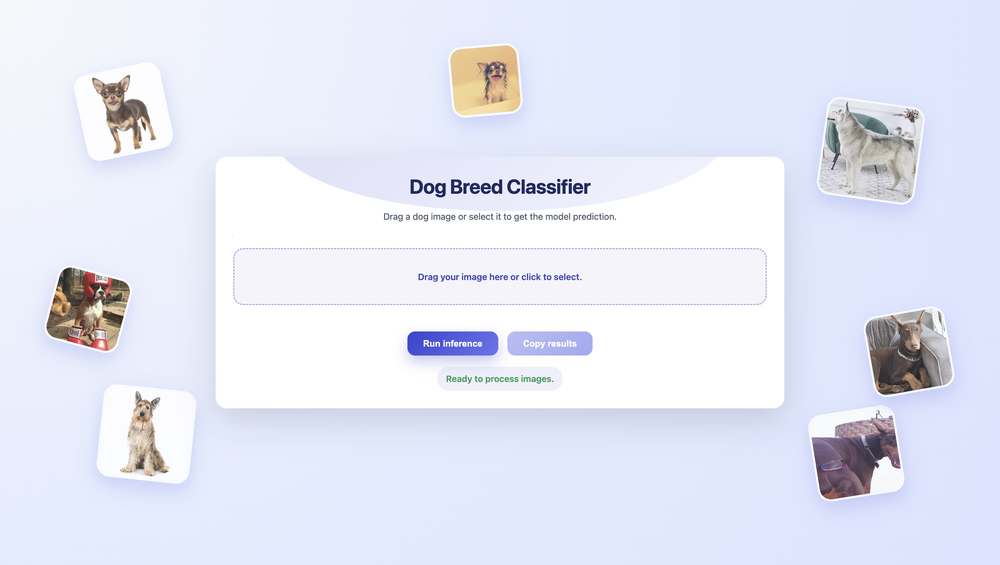
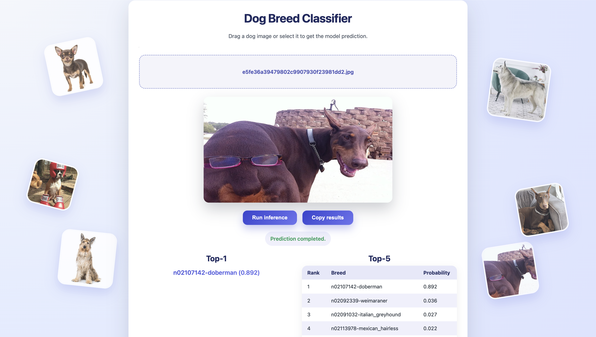
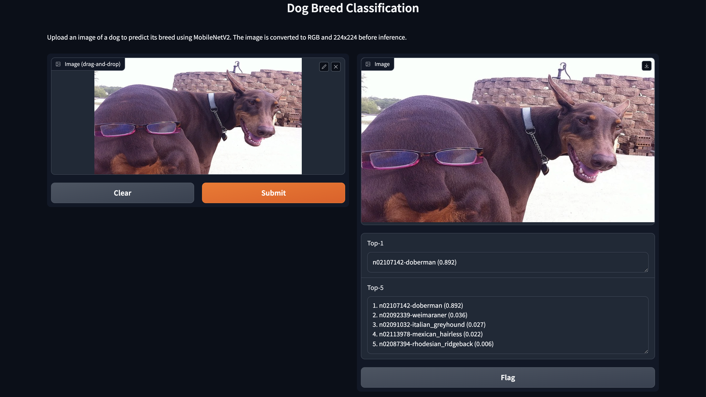
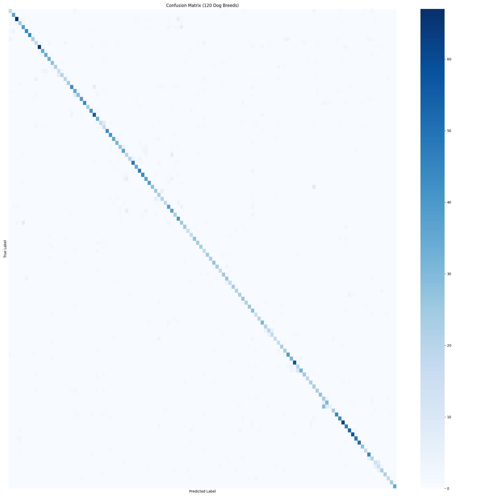

# Stanford Dogs Classifier (CS231n Standard) 🐶


A professional implementation of image classification focused on **Maintainability**, **Reproducibility**, and **Production Deployment**, inspired by the standards of Stanford's [CS231n: Deep Learning for Computer Vision](http://cs231n.stanford.edu/) course.



### Inference Demos

**1. Custom HTML Interface** (uses `python ui/api_server.py`):


**2. Gradio Interface** (uses `python ui/app.py`):


### Interactive Notebook:

[](https://colab.research.google.com/github/AgentBooster/portfolio-projects/blob/main/Machine_Learning_Deep_Learning/vision_image_classifier_cnn/notebooks/demo_inference.ipynb)

---

## 🔬 1. Introduction and Objectives

The goal is to correctly classify 120 breeds of dogs using the **Stanford Dogs** dataset (a subset of ImageNet). Unlike basic tutorials, this project implements a robust software engineering pipeline ("The Power Move") to ensure honest evaluation and prevent _data leakage_.

### Architecture

- **Backbone**: MobileNetV2 (Pre-trained on ImageNet).
- **Head**: Global Average Pooling + Dropout (0.2) + Softmax.
- **Optimizer**: Adam with _Learning Rate Scheduling_ (`ReduceLROnPlateau`).

**Note on Hardware**: This model was successfully trained locally on a **MacBook Air M3 (8GB RAM)** without memory issues, leveraging the efficiency of MobileNetV2.

---

## 📊 2. Data Strategy ("The Power Move")

To comply with the academic rigor of CS231n, we have restructured the default splits of `tensorflow_datasets` to ensure a **strictly isolated** test set.

| Split          | Original Source     | Quantity | Purpose (CS231n)                                           |
| :------------- | :------------------ | :------- | :--------------------------------------------------------- |
| **Train**      | 100% Original Train | ~12,000  | Training with Data Augmentation (Flip, Rotation, Zoom).    |
| **Validation** | 50% Original Test   | ~4,290   | Hyperparameter Tuning and Early Stopping.                  |
| **Test**       | 50% Original Test   | ~4,290   | **Single Final Evaluation**. Untouched during development. |

> **Note**: This strategy guarantees that the final reported metric (83%) reflects real-world performance, not overfitting to the validation set.

---

## 📈 3. Experimental Results

The model was trained for 10 epochs with _Early Stopping_.

- **Training Acc**: ~76%
- **Validation Acc**: ~81.7%
- **Test Acc**: **82.56%**

### Error Analysis

The classification report reveals exceptional performance on distinctive breeds and expected confusion on phenotypically similar breeds ("Snow Dogs").

- **Top Performers (100% Precision/Recall)**:
  - _Saint Bernard_
  - _African Hunting Dog_
  - _Papillon_
- **Areas of Confusion**:
  - _Siberian Husky_ vs _Malamute_: The model has low recall on Huskies, frequently confusing them with Malamutes and Eskimo Dogs due to nearly identical visual characteristics.



---

## 🚀 4. Installation and Usage Guide

### 0. Dataset (Automated)

**You do not need to manually download anything.** The training script (`src/train.py`) handles downloading the _Stanford Dogs_ dataset via TensorFlow Datasets (TFDS) the first time you run it.

### 1. Prepare Local Environment

```bash
python3 -m venv venv_tf
source venv_tf/bin/activate
pip install -r requirements.txt
```

### 2. Train Model

#### Option A: Local Training (Recommended M1/M2/M3)

If you have an Apple Silicon chip or dedicated GPU:

```bash
python src/train.py
```

#### Option B: Training on Google Cloud (Vertex AI)

If your local machine lacks resources, you can submit the job to the cloud (requires Docker configured):

1.  **Build Training Docker**:
    ```bash
    docker build -f Dockerfile.train -t gcr.io/PROJECT-ID/dog-trainer .
    ```
2.  **Push to Container Registry**:
    ```bash
    docker push gcr.io/PROJECT-ID/dog-trainer
    ```
3.  **Launch Job on Vertex AI**:
    ```bash
    gcloud ai custom-jobs create \
      --region=us-central1 \
      --display-name=dog-classifier-train \
      --worker-pool-spec=machine-type=n1-standard-4,replica-count=1,container-image-uri=gcr.io/PROJECT-ID/dog-trainer
    ```

### 3. Option A: Web UI (Recommended for Demos)

Uses **Gradio**, a modern interface ready to use.

```bash
# Launch the APP at http://0.0.0.0:7860
python ui/app.py
# Press Ctrl+C to stop the app
```

### 4. Option B: Custom HTML ("Polished" Design)

If you prefer the custom HTML interface with floating images:

1.  **Start the Backend (API)**:

    ```bash
    python ui/api_server.py
    # The server will listen on port 8080
    # Press Ctrl+C to stop the server
    ```

2.  **Open the Frontend (Live Server Mandatory)**:
    - Due to browser security policies (CORS/Paths), you can **NOT** open the file with a double click.
    - **Solution**: Open the file `ui/index.html` in VS Code and click the "Go Live" button (Live Server extension).
    - _Note_: To see the images correctly, ensure the `images` folder is next to `index.html`.

---

## ☁️ 5. Deployment on Google Cloud (Production Ready)

Following microservices architecture, the project is containerized for **Cloud Run**.

### Option A: Docker Deployment (Recommended)

The `Dockerfile` is optimized to serve the prediction API.

1. **Build the image**:

   ```bash
   docker build -t dog-classifier-api .
   ```

2. **Run locally (Test)**:

   ```bash
   docker run -p 8080:8080 -e PORT=8080 dog-classifier-api
   ```

3. **Deploy to Google Cloud Run**:

   ```bash
   # Push to Google Artifact Registry
   gcloud builds submit --tag gcr.io/PROJECT-ID/dog-classifier-api

   # Deploy Serverless Service
   gcloud run deploy dog-classifier \
     --image gcr.io/PROJECT-ID/dog-classifier-api \
     --platform managed \
     --region us-central1 \
     --allow-unauthenticated
   ```

## 📂 6. Project Structure

```
.
├── Dockerfile              # Container definition (Inference)
├── Dockerfile.train        # Container definition (Training)
├── README.md               # This document
├── requirements.txt        # Dependencies (pinned versions)
├── src/
│   ├── data_setup.py       # "Power Move" split logic
│   ├── train.py            # Training pipeline
│   ├── eval.py             # Rapid evaluation script
│   └── error_analysis.py   # Matrix and report generator
├── ui/
│   ├── api_server.py       # REST API (FastAPI/HttpServer)
│   └── app.py              # Interactive Demo (Gradio)
├── reports/                # Generated artifacts (Matrices, txt)
└── notebooks/              # Jupyter Notebooks for demos/experiments
```

---

## 📜 References

- **CS231n Project Guide**: [http://cs231n.stanford.edu/project.html](http://cs231n.stanford.edu/project.html)
- **Stanford Dogs Dataset**: [http://vision.stanford.edu/aditya86/ImageNetDogs/](http://vision.stanford.edu/aditya86/ImageNetDogs/)
- **MobileNetV2**: Sandler et al. (2018).

---

_Developed with ❤️ and engineering rigor._
