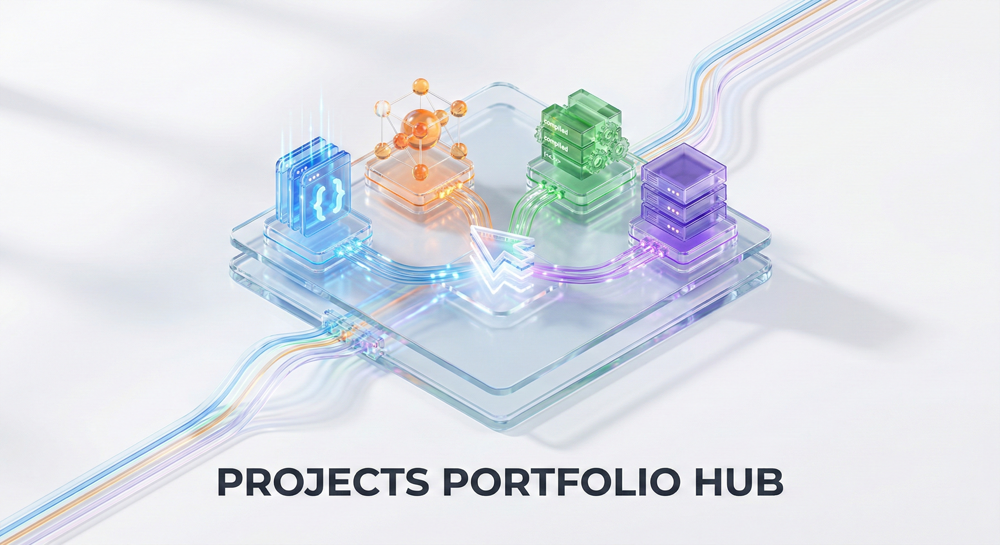
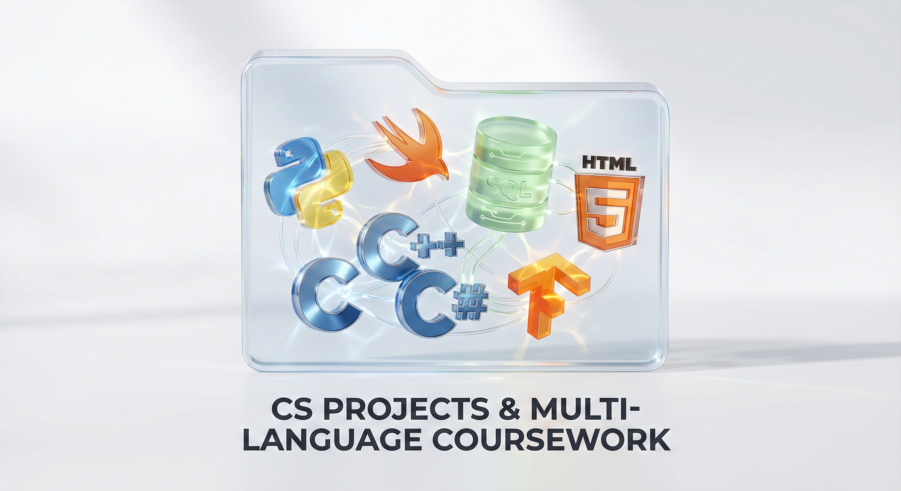
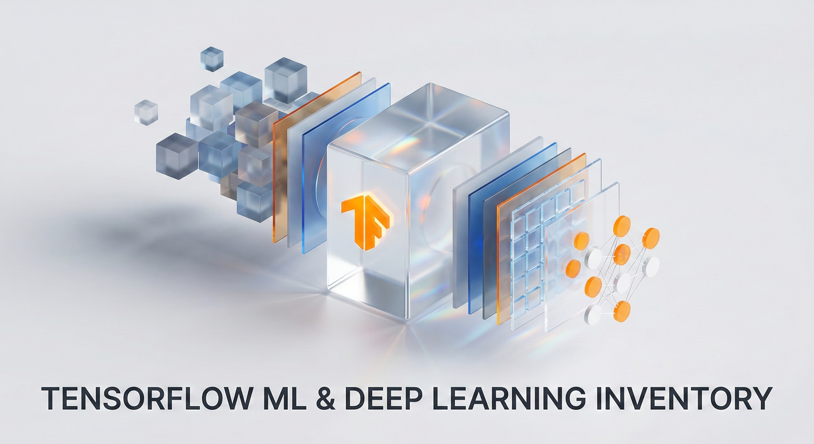
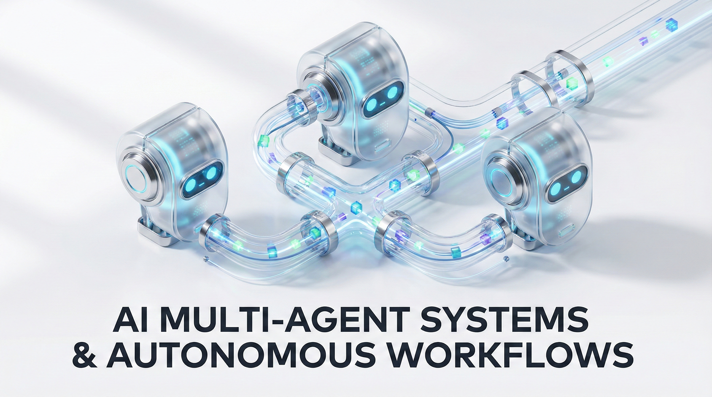
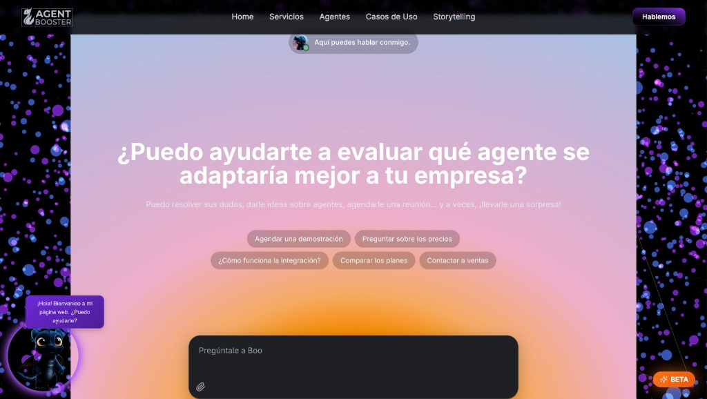

<h1 align="center">Portfolio Projects</h1>

Central repository for my multi-language software portfolio. 
It brings together CS projects, machine learning/deep learning projects, applications, and automation workflows in a single place.

<table align="center" border="2" cellpadding="8" cellspacing="0">
  <tr>
    <td>
      <table border="1" cellpadding="8" cellspacing="0">
        <tr>
          <td>
            
          </td>
        </tr>
      </table>
    </td>
  </tr>
</table>

## Featured Areas

### Featured Snapshot

<table>
  <tr>
    <td width="33%" valign="top">
      
       
      <strong>CS Projects</strong>
    </td>
    <td width="33%" valign="top">
      
       
      <strong>Machine Learning / Deep Learning</strong>
    </td>
    <td width="33%" valign="top">
      
       
      <strong>Widget Agents</strong>
    </td>
  </tr>
</table>

### CS Projects (Py, C-Family, Swift, SQL)

Language-focused portfolio with project-based implementations and organized coursework archives.

  

### Machine Learning & Deep Learning

TensorFlow/Keras projects for forecasting, computer vision, and model-driven interfaces.

  

### Widget Agents (Demo)

Embeddable multi-agent demo focused on UX and process automation integration patterns.

  

#### Boo Widget

> Live demo: [agentbooster.ai](https://agentbooster.ai)

  

## Repository Map

| Folder                            | Focus                                                            |
| --------------------------------- | ---------------------------------------------------------------- |
| `CS_Projects_Py_CPP_Swift_SQL/`   | CS projects, language-based organization, and coursework archive |
| `Machine_Learning_Deep_Learning/` | ML/DL experiments, pipelines, and model applications             |
| `Software_Frontend/`              | Frontend software interfaces and UI projects                     |
| `Widget_Web_Agent/`               | Web agent widgets (Vanilla, React, and variants)                 |
| `n8n_JSON/`                       | Automation workflow templates for n8n                            |

## Quick Navigation

- [CS_Projects_Py_CPP_Swift_SQL](CS_Projects_Py_CPP_Swift_SQL/)
- [Machine_Learning_Deep_Learning](Machine_Learning_Deep_Learning/)
- [Software_Frontend](Software_Frontend/)
- [Widget_Web_Agent](Widget_Web_Agent/)
- [n8n_JSON](n8n_JSON/)

## Notes

- Each main folder includes its own `README.md` with setup and usage details.
- This root README stays intentionally high-level to remain easy to maintain as the portfolio grows.
