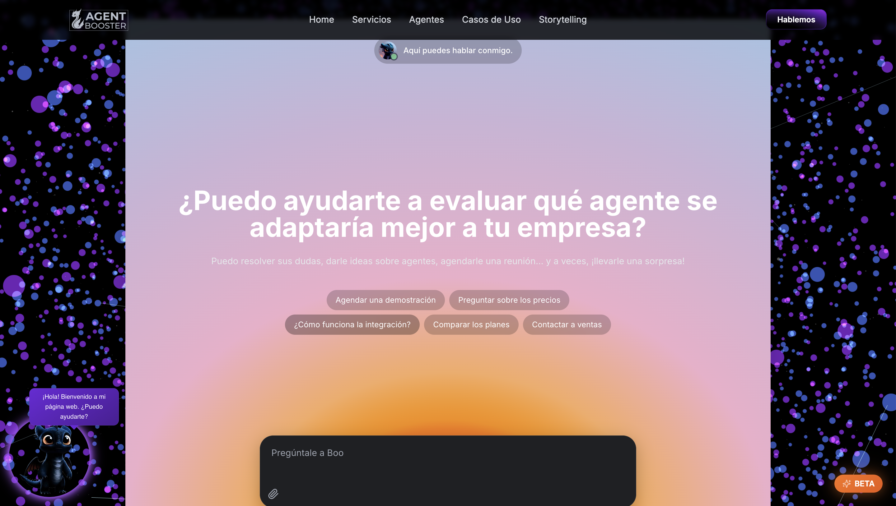

# AgentBooster Web Project

[](https://AgentBooster.github.io/agentbooster/)
🌍 **Live Demo:** [https://AgentBooster.github.io/agentbooster/](https://AgentBooster.github.io/agentbooster/)

Welcome to the AgentBooster repository. This is an advanced, multi-route web application.

## Technologies Used

This project is built with:

- **Vite**
- **TypeScript**
- **React**
- **shadcn-ui**
- **Tailwind CSS**

## Getting Started Locally

To work locally, follow these steps to download the repository, access the directory, and run the development environment:

1. **Clone the repository**:

```bash
git clone https://github.com/AgentBooster/agentbooster.git
```

2. **Navigate into the project directory**:

```bash
cd agentbooster
```

3. **Install dependencies**: Make sure you have Node.js or Bun installed in your environment, then run:

```bash
npm install
# or
bun install
```

4. **Run the development server**:

```bash
npm run dev
# or
bun run dev
```

Once running, navigate to the local URL (usually `http://localhost:8080/`) in your browser to view the application interactively. Any changes you make to the `src/` files will Hot-Reload automatically.

## Deployment

The application is prepared to be built as a Single Page Application. You can build it using:

```bash
npm run build
```

This will generate a `dist` directory with the compiled, minified code ready to be deployed to any static host (like GitHub Pages, Vercel, Netlify, or standard Apache/Nginx instances).
