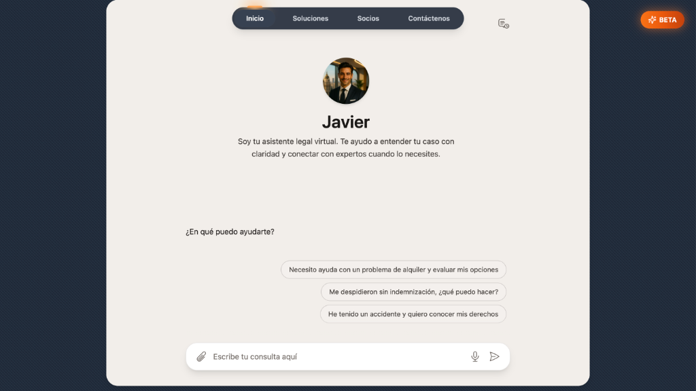
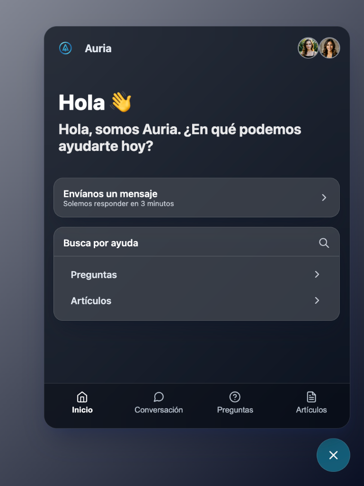
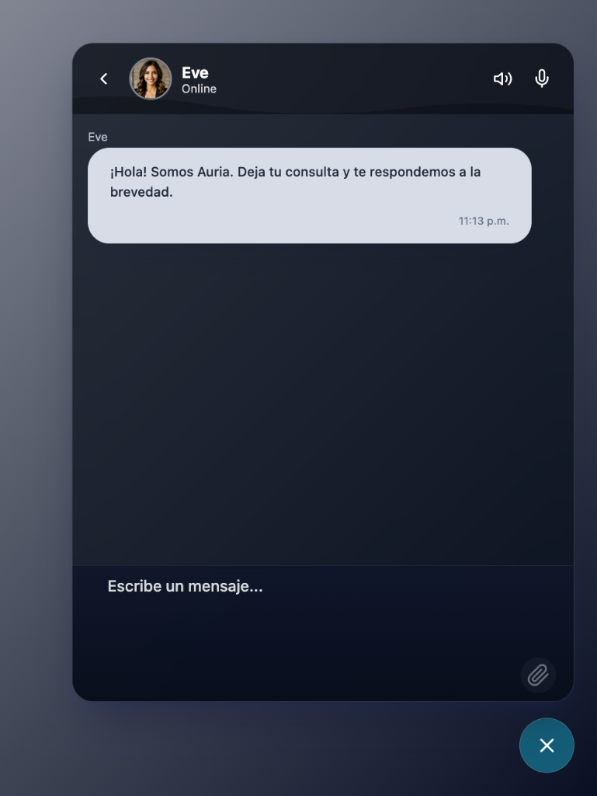
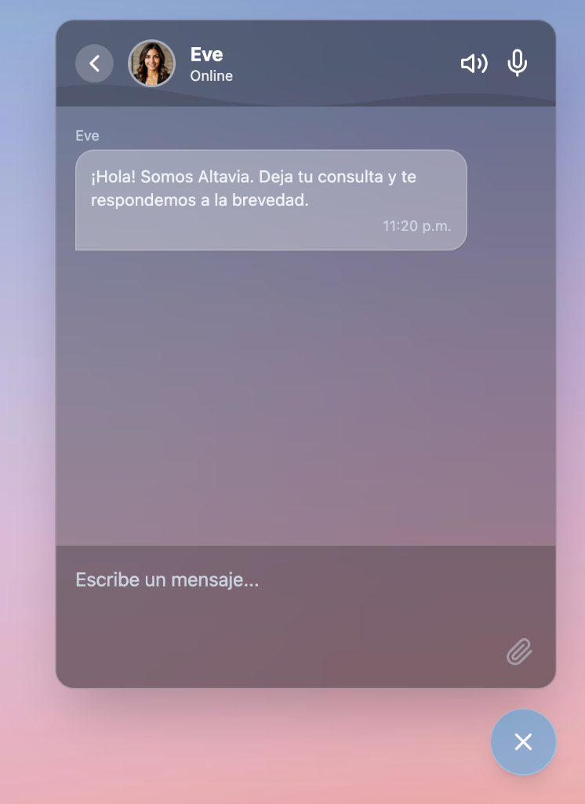
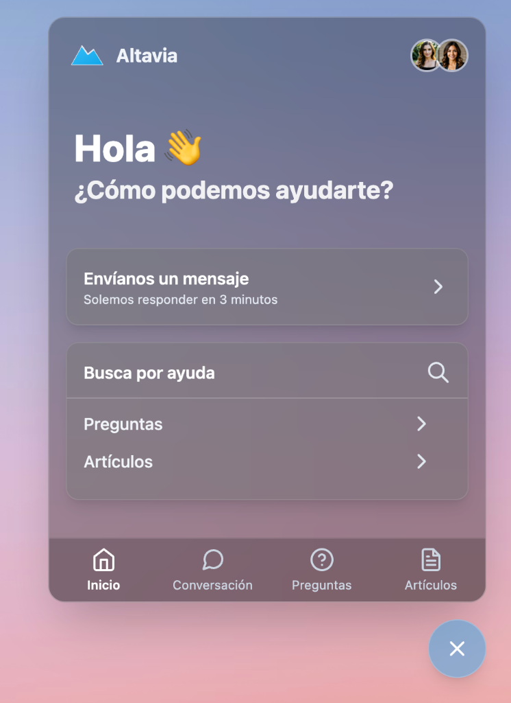

# Widget_Web_Agent

Embeddable conversational widget collection, organized by implementation type. Built for support, lead capture, and webhook automation.

#### Video Demo: [https://youtu.be/FZiIpD6OlYc](https://youtu.be/FZiIpD6OlYc) **(IN SPANISH)**

**Stop Losing Patients: How to Automate Your Medical Clinic’s Front Desk**

## Widget Previews

### Boo Widget

> Live demo: [agentbooster.ai](https://agentbooster.ai)

### Risolvia Alternativo

> Alternative style: [risolvia.com](https://risolvia.com)

### React & Vanilla Widget

  
  

### Liquid Glass Widget

  
  

## Use Cases & Adaptability

This widget structure is designed for **agentic automation** and can be adapted to any sector.

- **Example Implementation (Clinics)**: See how this widget integrates into a real-world scenario for clinics: [https://youtu.be/FZiIpD6OlYc?si=0EAt1zkK3dnfHtz2](https://youtu.be/FZiIpD6OlYc?si=0EAt1zkK3dnfHtz2).
- Although the video focuses on the clinical sector, the logic is fully adaptable to any other industry requiring automated agentic interaction.

## Project Structure

This directory (`Widget_Web_Agent`) consolidates different widget implementations and versions:

- **`vanilla_widget/`**: Lightweight, embeddable Vanilla JS version.
  - Contains `widget.js` and `widget-embed.html`.
- **`react_widget/`**: Standalone React component version.
  - Contains `Widget.tsx`.
- **`widget_liquid_glass/`**: Full Vite + React + TypeScript demo project.
- **`boo_widget/`**: Production widget used on the **Boo** company site.
  - **Vanilla JS** implementation (standalone `boowidget.js`).
  - Uses Tailwind via CDN and Google Fonts (Inter).

## Quick start (Vanilla JS)

1.  Navigate to `vanilla_widget/`.
2.  Open `widget-embed.html` in your browser.
3.  The demo loads `widget.js`.

## Basic configuration

Most versions share a similar configuration object (usually defined in `widget.js` or passed as props):

- `company_name`
- `welcome_message`
- `logo_url`
- `webhook_url` (from your n8n workflow)
- `agents` (name and avatar)

## Backend & n8n Workflows

To power the widget with an intelligent agent, you can use our pre-built **n8n workflows**.

1.  Navigate to the `n8n_JSON/flows` directory in this repository.
2.  Choose a use-case flow that fits your needs.
3.  Import the JSON file into your n8n instance.
4.  Activate the workflow and copy the **Production URL** of the Webhook node.
5.  Paste this URL into the `webhook_url` field in your widget configuration.

### Python Agent (Advanced & Scalable)

For a more robust and scalable solution, you can develop your agent in Python. You can use the **LangChain** library or API to build and test your agent's capabilities.

- We provide a starter template in: `CS_Projects_Py_CPP_Swift_SQL/python/python_agent/fisia_agent_langchain`
- This approach is recommended if you need advanced logic, memory management, or custom integrations beyond what n8n offers.

## Version notes

- **Vanilla (`vanilla_widget`)**: Best for embedding in existing sites (WordPress, custom HTML). No build step required.
- **React (`react_widget` / `widget_liquid_glass`)**: Best for modern web apps. `widget_liquid_glass` is a complete development environment to test and modify the React component.

## `widget_liquid_glass` notes

- Stack: Vite + React + TypeScript + Tailwind; `index.html` loads `src/main.tsx`.
- Scripts in `package.json`: `dev`, `build`, `preview`.
- Requires Node.js and `npm` (Node Package Manager) to install dependencies and run scripts.
- To try it: `npm install`, `npm run dev`, then open the local URL printed by Vite.
