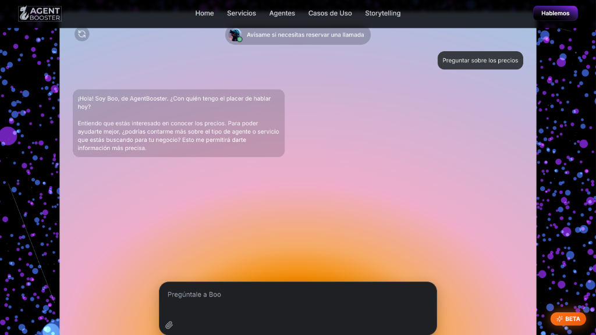

# boo_widget

Embeddable chat widget used on the **Boo** company site. This folder contains the standalone JavaScript file and reference documentation.

- Try it live in our web app: https://agentbooster.ai
- Test an alternate style here: https://risolvia.com

## Previews




> **Note:** The widget is the colorful rectangular component and its interactive elements.

## Contents

- `boowidget.js`: widget script (paste the full code here).

## Quick start

1. Ensure your page has a mount element with the correct ID:

```html
<div id="widget-container"></div>
```

2. Load the script (ideally before `</body>`):

```html
<script src="./boowidget.js"></script>
```

If you change the mount ID in the HTML, you must also update `targetDivId` in `boowidget.js`.

## n8n flow

Template location in this repository: `Flows_JSON/n8n/BooWebMeet.json`

## External services

- Tailwind CSS via `https://cdn.tailwindcss.com`
- Google Fonts (Inter) via `https://fonts.googleapis.com`
- Image assets hosted on Cloudinary
- Webhook URL configured inside `boowidget.js`
