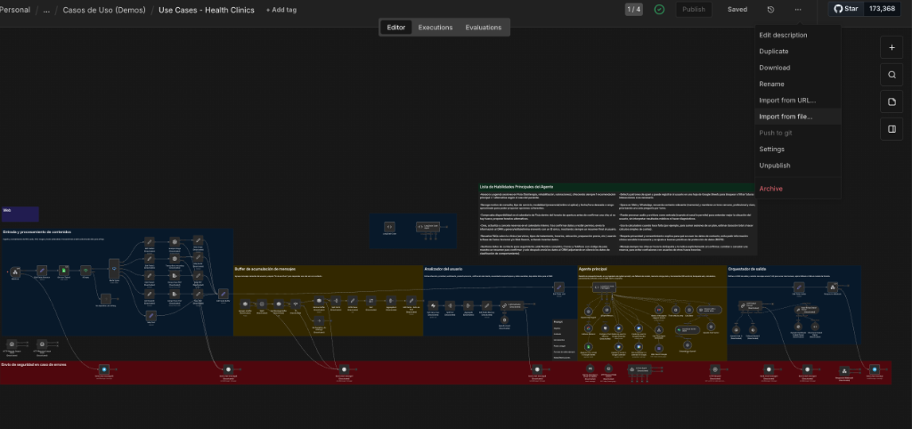

# n8n_JSON

Collection of JSON workflows ready to import into n8n. This directory groups
marketing automations, CRM integrations, and operational tasks that serve as a
base or template for projects.

## What is inside

- `flows/`: workflows exported from n8n in JSON.

## How to import into n8n

1. In n8n, go to **Workflows** and choose **Import from File**.
2. Select the JSON file.
3. Review credentials, tokens, and endpoints before enabling.

## Best practices

- Duplicate the workflow before major changes.
- Replace credentials and sensitive variables with your own values.
- Document the workflow version in the n8n description.

## Status

These flows do not include credentials or secrets. If a flow fails to import,
check the n8n version or node dependencies.
